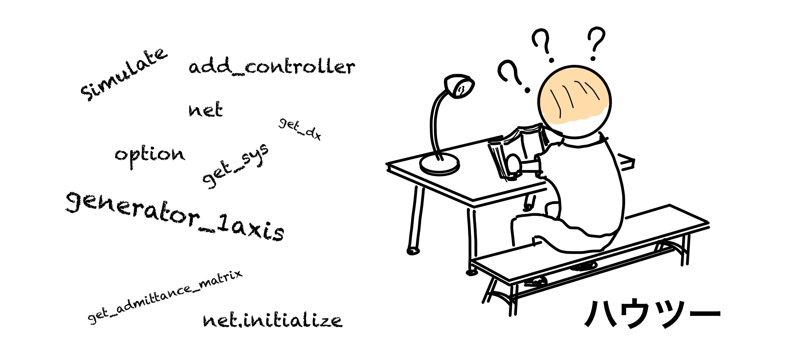
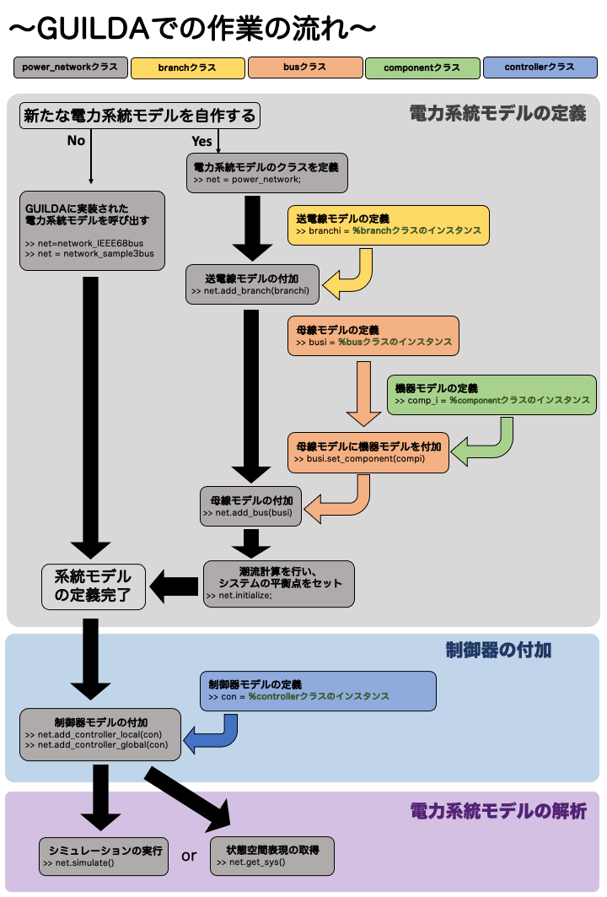
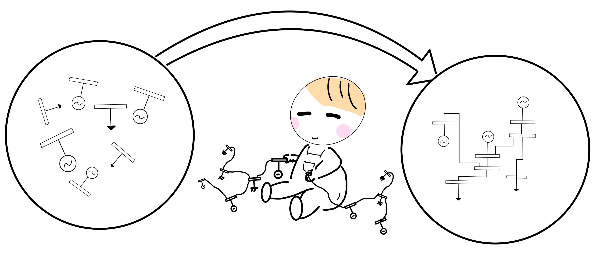
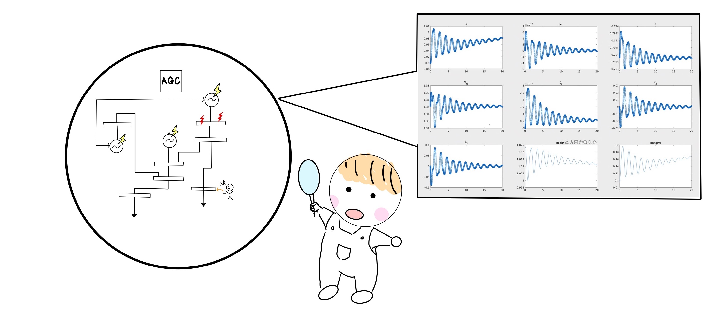
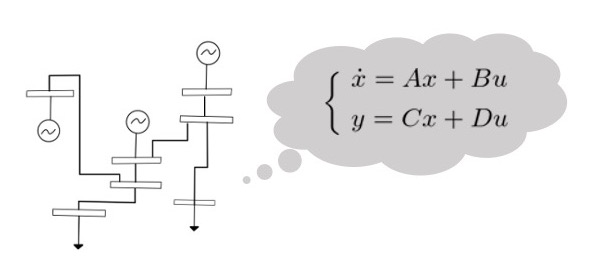

# <div style="text-align: center;"><span style="font-size: 130%; color: black;">リファレンス</span></div>

---

---

<div align="center"></div>

本ページではGUILDAを使用する際の作業を上図のように大きく3つのパートに分けて解説します。

1. 電力系統モデルの定義
2. 電力系統モデルへの制御器の付加
3. 数値シミュレーションなどの解析実行

以下、各パートごとに解説していきます。

## <div style="text-align: center;"><span style="font-size: 150%; color: gray;">__【電力系統モデルの定義】__</span></div>
GUILDAのソースコードには，いくつかの電力システム(3bus,68busシステム)を定義するためのスクリプトファイルが用意されています。取り敢えず電力系統モデルを適当に実装し、それに対し制御器の性能評価やシミュレーションを行いたいという方は、下のように実行すれば簡単に系統モデルを作成することができます。

```matlab
%サンプルコード
net = network_sample3bus;  %3busモデルの情報をnetに格納する
net = network_IEEE68bus; %68busモデルの情報をnetに格納する
```
新たな電力系統モデルの作成や、新たな動特性を持った機器モデルを自身で実装し系統モデルに組み込みたいという場合は、以下の画像リンクから解説ページに進んで下さい。<br>__(↓clickして解説ページへ)__<br>  
[<div align="center"></div>](./defineNet/0TopPage.md)

---

## <div style="text-align: center;"><span style="font-size: 150%; color: RoyalBlue;">__【制御器の付加】__</span></div>

この節では、前節で定義したpower_networkクラスの変数 __`net`__ 内にcontrollerクラスで定義された制御機を付加する方法を説明します。また新たな制御器もでるを構築しGUILDA上に実装するための機能要件についても説明します。__(↓clickして解説ページへ)__<br>  
[<div align="center"></div>](./addController/0TopPage.md)

 ---

## <div style="text-align: center;"><span style="font-size: 145%; color:DarkOrchid;">__【電力系統モデルの解析】__</span></div>

前節までで電力系統モデルを`power_network`というクラスで定義する方法。そしてその電力系統モデルに制御器を付加する方法を解説しました。本節では、そのモデルを用いて、実際に数値解析を行う方法を解説します。

### <div style="text-align:"><span style="font-size: 120%; color: black;">__・シミュレーションの実行__</span></div>
ここでは、シミュレーションの実行方法を解説します。シミュレーションの条件設定の仕方や、その出力結果の応答データの読み方を解説します。__(↓clickして解説ページへ)__<br>  
[<div align="center"></div>](./Analysis/net_simulate.md)
### <div style="text-align:"><span style="font-size: 120%; color: black;">__・線形化モデルの導出__</span></div>
ここでは、作成した電力系統モデルの近似線形化モデルの導出を解説します。<br>__(↓clickして解説ページへ)__<br>
[<div align="center"></div>](./Analysis/net_getsys.md)
