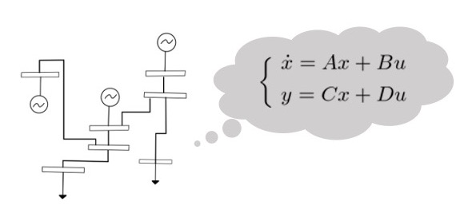
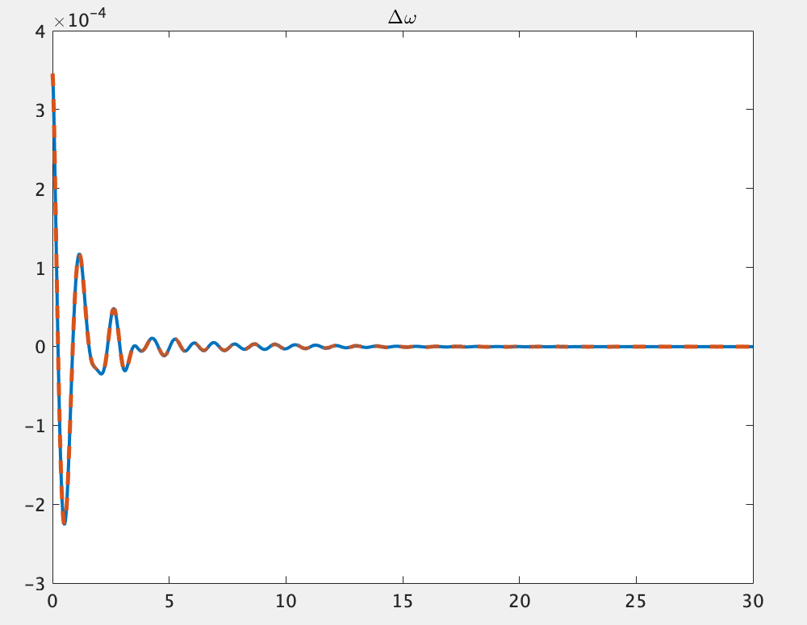
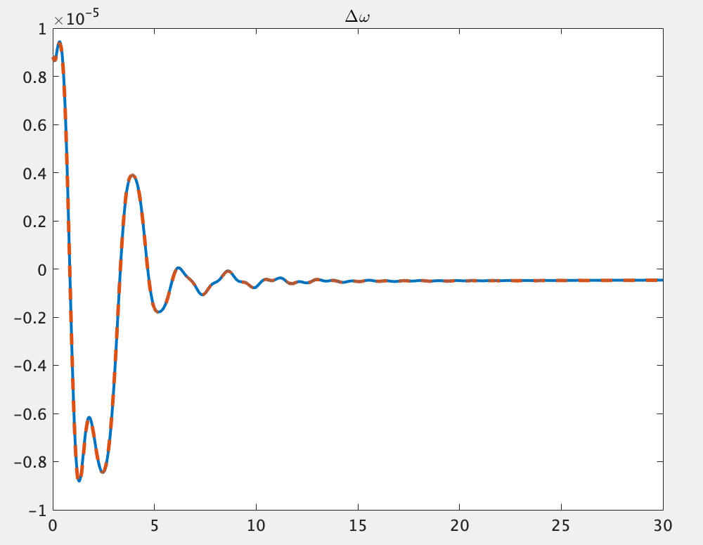

# <div style="text-align: center;"><span style="font-size: 130%; color: black;">線形化モデルの導出</span></div>

---

- 本ステップでできるようになること
    - 線形化したシステムの状態空間表現を取得できるようになる
    - 線形化したシステムについてシミュレーションすることができるようになる

## 解説
### ネットワークの定義
まず、システムの線形化をしていくにあたりシステムを定義します.  
ここでは68busの電力システムを例として以下のように定義します.
```
net = network_IEEE68bus();
```

- 出力変数`net`  
    ネットワーク内部の情報としてbus, branch, generator, controllerなどの情報を含む[power_network](../../SourceCode/power_network.md)のインスタンスです。
    電力ネットワークの全ての情報を持った変数というイメージを持ってもらえれば問題ないです。
<br>

### __線形化したシステムのシュミレーションの実行__
線形化したシステムのシュミレーションは以下のように行います。
```
out = net.simulate([0 20], 'linear', true);
```
`linear`の直後に`true`とした場合はシステムを線形化してシミュレーションを行い、`false`とした場合は線形化を行わずにシュミレーションを行います.  
それ以外の変数の設定や実行については、シミュレーション実行の[解説ページ](../Analysis/net_simulate.md)に示されている`net.simulate(t,option)`と同様であるため，そちらを参照してください.
<br>

### __線形化したシステムの状態空間表現を得る__
####　関数`get_sys`の解説  
この関数は対象の電力システムを以下の式の様な状態空間表現に線形化するための関数です
.  
$$
    \begin{matrix}
  　\dot{x}=A(x-x^*)+B(u-u^*)\\
    　y=C(x-x^*)+D(u-u*)\\
    \end{matrix}
    $$  
なお上の式で表される状態・入力・出力の定義は、1軸発電機モデルを例に取ると以下のようになります.
当然、機器が変わると状態等も変わりますので、注意してください。  

以下の説明において、発電機とある場合には、すべて1軸発電機を指していると解釈してください。

- 状態$x$  
         １つの発電機につき状態パラメータが７つ存在します．  
         あるi番目の発電機の状態を$x_i$とすると、
    $$
      x_i =\left(
        %\begin{align}
        \begin{array}{ccccccc}
        \delta_i %&= 回転子偏角
        \\
        \Delta\omega_i %&= 周波数偏差
        \\
        E_i %&= 内部電圧
        \\
        V_{\mathrm{fd}i} %&= AGCの状態変数
        \\
        \xi_{1i} %&= PSSの状態変数１
        \\
        \xi_{2i} %&= PSSの状態変数２
        \\
        \xi_{3i} %&= PSSの状態変数３
        \\
        \end{array}
        %\end{align}
        \right)
    $$  
        と表され、上から順に  
      - 回転子偏角$\delta$  
      - 周波数偏差$\Delta\omega$  
      - 発電機の内部電圧$E$  
      - AGCの状態変数$V_{\mathrm{fd}}$(1つ)  
      - PSSの状態変数$\xi$(3つ)  
    を指します.
    この状態$x_i$を用いて、発電機が全部で$I_G$個あるとき、
    $$
    x=\left(
        \begin{array}{}
        x_1\\
        \vdots\\
        x_{I_G}\\
        \end{array}
    \right)
    $$
    としたものが上の式で状態$x$として定義されています。  

- 入力$u$ 

    いま対象の電力システムのバスのうち発電機がつながった母線と負荷がつながった母線の個数の合計を$I_{GL}$、発電機がつながった母線の個数を$I_G$とすると、
    $$
    u=\left(
        \begin{array}{}
        u_1\\
        \vdots\\
        u_{I_{GL}}\\
        \\d_1\\
        \vdots\\
        d_{I_G}\\
        \end{array}
    \right)\cdots(★)
    $$
    が入力$u$として定義されています.
    ($★$)の要素となる$u_i$と$d_i$は次のような入力になります。

    - $u_i$について：
    発電機に対する入力か、負荷に対する入力かで$u_i$の中身は変わります。

        - 発電機：
            入力は２つ存在し、$i$番目の発電機への入力は
                $$
                u_i=\left(
                    \begin{array}{}
                    u^{(i)}_{\mathrm{avr}}\\
                    u^{(i)}_{\mathrm{governor}}\\
                    \end{array}
                \right)
                $$
            のようにかけます。
            ただし。$u_{\mathrm{avr}}$はAVRからの入力で、$u_{\mathrm{governor}}$はgovernorを介したAGCからの入力を示しています。
            なお、AVRが接続されていない発電機は$u_{\mathrm{avr}}$が０になります。

        - 負荷：
            入力は２つ存在し、$i$番目の負荷への入力は
                $$
                u_i=\left(
                    \begin{array}{}
                    u^{(i)}_1\\
                    u^{(i)}_2\\
                    \end{array}
                \right)
                $$
            のようにかけます。
            ただし、これらの入力は、元の負荷のアドミタンスを$Y_{\mathrm{ori}}$としたとき、アドミタンス$Y$が
                $$
                Y =
                \mathrm{Re}(Y_{\mathrm{ori}}) \times (1+u_1) + j\mathrm{Im}(Y_{\mathrm{ori}}) \times (1+u_2)
                $$
            で時間変化するように、それぞれアドミタンスの実部と虚部の増加割合を示しています。
      
    - $d_i$ について：
    外乱を表す変数になります。
    制御系の設計時に外乱が必要になったら使うものなので、単にシミュレーションを行いたい時などは気にする必要はないです。
    外乱を使う場合は、入力ベクトル$u$の要素として入れていることからも分かる通り、外部入力として外乱を入れることになることに注意してください。
    $i$番目の機器に加わる外乱の数が$n$個であるとすると、
        $$
        d_i=\left(
            \begin{array}{}
            d^{(i)}_{1}\\
            \vdots\\
            d^{(i)}_{n}\\
            \end{array}
        \right)
        $$
    と表されます。
    ($★$)では外乱は$d_1$〜$d_{I_{G}}$となっており、発電機にのみ加わっているように書いてあります。
    これは、発電機に加わる外乱に比べると負荷に加わる外乱は小さいので無視しているということを意味しています。
    もちろん、負荷にも外乱を加えることもできますが、その時は外乱を表すベクトル$d$の要素数も変わるので、[STEP5](../step5)に出てくる外乱に関するシステム行列$R$も辻褄が合うように定義し直してください。

- __出力$y$__  
        出力変数$y$の各行は以下の変数をさしている。  
        各発電機の状態変数 ($x$)： 各７要素$\leftarrow$状態$x$の場合の７つの変数と同じです  
        発電機の評価関数 ($z$) : 各１要素$\leftarrow$制御系を設計するときに評価基準とする変数です  
        各バスでの電圧の値($V_{\mathrm{real}},V_{\mathrm{image}}$) : 各2要素(実部と虚部の情報)  
        各バスでの電流の値($I_{\mathrm{real}},I_{\mathrm{image}}$) : 各2要素(実部と虚部の情報)  
        対象の電力システムのバスのうち全バスの個数を$I_{all}$、発電機のつながった母線の個数を$I_G$とすると、
    $$
    y=\left(
        \begin{array}{}
        x_1\\
        \vdots\\
        x_{I_G}\\
        \\z_1\\
        \vdots\\
        z_{I_G}\\
        \\V_1\\
        \vdots\\
        V_{I_{all}}\\
        \\I_1\\
        \vdots\\
        I_{I_{all}}\\
        \end{array}
    \right)
    $$
    という構成になっている。なお各$V_i$と$I_i$はフェーザ表示で表されるため、
    $$
    V_i=\left(
        \begin{array}{}
        V_{\mathrm{real}}\\
        V_{\mathrm{image}}\\
        \end{array}
    \right)
    \quad,\quad
    I_i=\left(
        \begin{array}{}
        I_{\mathrm{real}}\\
        I_{\mathrm{image}}\\
        \end{array}
    \right)
    $$と２変数ずつ格納されています.


#### 関数get_sysの実行
```
sys =  net.get_sys(with_controller);
```
get_sysで得られるシステムは平衡点からの偏差を状態としてとっていることに注意してください．

- **入力引数**`with_controller`  
    with_controllerの値が`true`の場合はコントローラが付加されたシステム，`false`の場合はコントローラなしのシステムを返す．規定値は`false`です。
      - `true`にする場合コントローラーの設定をしておく必要があります。コントローラの定義についての詳細は[STEP3](../step3)を参照してください。


- **出力変数**`sys`  
  出力された変数sysの中には以下のような変数が格納されています。  

  <div style="text-align: center;">
   </div>  
  これらの変数の中には`get_sys`のスクリプト内で使用されている関数[ss(A,B,C,D)](https://jp.mathworks.com/help/control/ref/ss.html)によって自動的に生成される変数も含まれており、このうち実質的に情報を持っているのは以下に示す6つの変数のみです。  
    - __状態方程式の係数行列__`A,B,C,D`  
            線形化したシステムの状態行列A,入力行列B,出力行列C,直達行列Dの各要素の情報を格納しています.  
    - __入力情報__`InputGroup`  
            状態空間方程式の入力ベクトル$u$の各チャンネル名と何番目のチャンネルに対応するかの情報を格納しています。  
    - __出力情報__`OutputGroup`  
            状態空間方程式の出力ベクトル$y$の各チャンネル名と何番目のチャンネルに対応するかの情報を格納しています。  

`get_sys`の返り値は`sys`としていますが、当然違う名前を宛てることもできます。
以降の接目では、`sys`という変数名を返り値にしたと仮定しますが、違う名前を設定した場合にはその都度変換して考えてください。

##　例１：コントローラーを追加する
```
sys =  net.get_sys(true);
```
この関数を実行するにはnetクラスの中にすでにコントローラーの情報が格納されている必要があります.  
予め実装されている`power_network`のインスタンスを用いている場合、そのクラスの内部にはすでにブロードキャストのコントローラーなどが定義されています。それに加えてレトロフィットコントローラーなどを追加して定義しておくと、それらのコントローラを含めたシステムの状態空間方程式を導出させることができます。コントローラの設定については制御器付加の[解説ページ](../addController/0TopPage.md)を参照してください.  
なお、`get_sys(false)`とするとコントローラーを除いたシステムの状態空間方程式を導出するということになります.


## 例２：特定の入力から出力までのシステムを見る
返数のsysに格納されているA行列B行列C行列D行列はバスの個数によっても大きさが変動し、本チュートリアルで扱っている電力システムも68個のバスによるシステムであり、その状態方程式は膨大な要素数を持つ行列方程式です.
ここでは、そのシステムの中から特定の入力から特定の出力までの一部分だけのシステムを抽出する方法を示します.
例えば入力`d1`から出力`z1`までのシステムを見たい場合，以下のように実行することで見ることができます.
```
sys('z1','d1')
```


## 例３：線形化したシステムのシミュレーション結果を見る

以下のコードは68busシステムを線形化し，その出力をグラフで表示するものです。ここでは2種類のサンプルコードを紹介します。  
  

まず1つ目のコードは、地絡応答についての応答を線形化を行ってシュミレーションしたプロットに、`get_sys`を用いて得られた状態空間モデルをもとに、`initial()`関数を用いて時間応答を求めたものを重ねたものです。下の結果を見ると2つの時間応答が一致していることがわかります。なお`initial()`は[Control System Toolbox]に標準搭載されている関数です。
```
net= network_IEEE68bus();
option_fault = struct();
option_fault.fault = {{[0, 0.01], 1}};
option_fault.linear = true;
out_fault = net.simulate([0, 0.01], option_fault);
option = struct();
option.x0_sys = horzcat(out_fault.X{:});
option.x0_sys = option.x0_sys(end,:)';
option.linear =true;
tmax = 30;
out_linear = net.simulate([0 tmax], option);
sys = net.get_sys();
x0 = horzcat(out_fault.X{:});
x0 = x0(end, :)' - net.x_equilibrium;
[z, t, x] = initial(sys, x0);
numele = size(find(t<tmax), 1);
z = z(1:numele, :);
t = t(1:numele, :);
x = x+net.x_equilibrium';
x = x(1:numele, :);
for i = 1:16
	figure
	p = plot(out_linear.t, out_linear.X{i}(:, 2), '-', t, x(:, 7*(i-1)+2), '--');
    p(1).LineWidth = 2;
    p(2).LineWidth = 2; 
    title('\Delta\omega', 'Interpreter', 'tex');
    legend('ODE solver','initial func')
end
```
  


  
2つめコードは１つめと同様に地絡応答についてのシュミレーションですが、ここでは同じネットワークシステム、同じ地絡条件のもとで線形化シュミレーションと非線形のままのシュミレーションの結果を比較するコードとなっています。出力結果は下のとおりです。
```
net = network_IEEE68bus();
option = struct();
option.fault = {{[0,0.01], 1}};
option.linear = false;
out_nonlinear = net.simulate([0, 30], option);
option.linear = true;
out_linear = net.simulate([0, 30], option);
for i = 1:16
	figure
	p = plot(out_linear.t, out_linear.X{i}(:, 2), '-',out_nonlinear.t, out_nonlinear.X{i}(:, 2), '--');
    p(1).LineWidth = 2;
    p(2).LineWidth = 2;
    title('\Delta\omega', 'Interpreter', 'tex');
    legend('linear','nonlinear')
end
```
  

