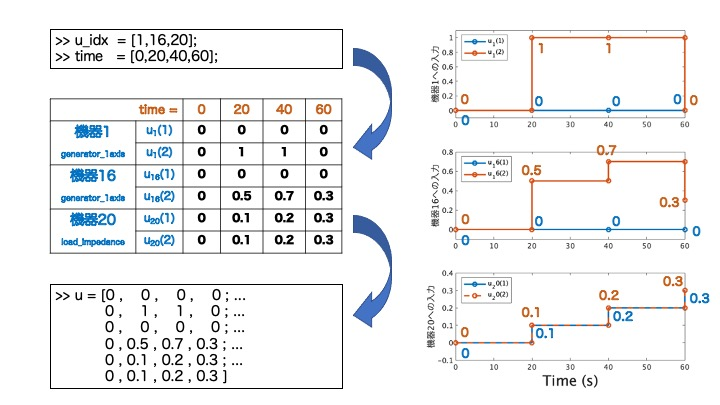
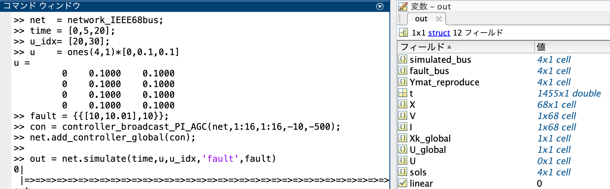
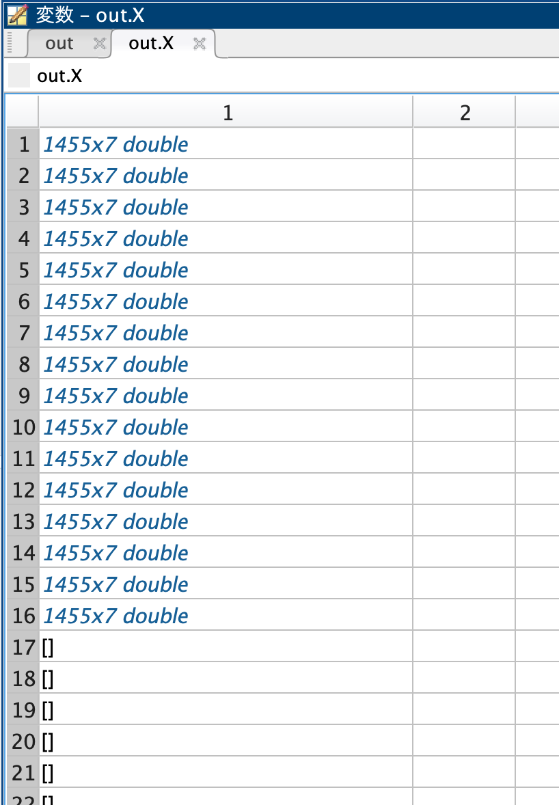
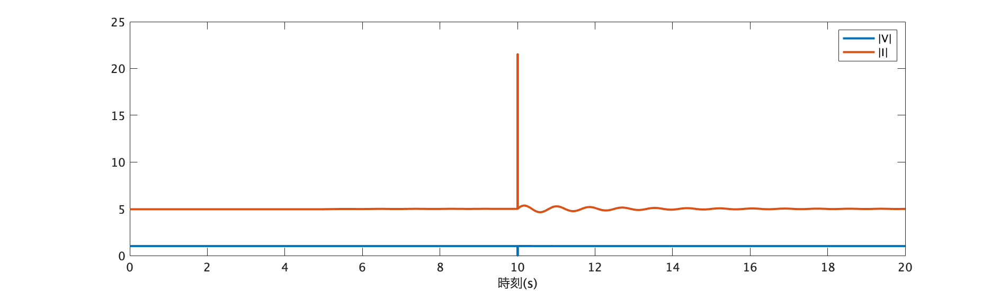

# <div style="text-align: center;"><span style="font-size: 130%; color: black;">数値シミュレーションの実行</span></div>

***
前の章では電力ネットワークを定義し、その情報を変数`net`に格納する所までできたと思います。
本章では、その変数`net`をクラス内でメソッドとして定義されている関数を用いて、シュミレーションしていきます。まだ変数`net`を定義していない場合は、電力系統モデル作成の[解説ページ](../defineNet/0TopPage.md)を参考にして下さい。  
<br>
<span style="font-size: 110%; color: black;">__・本章を始めるにあたって用意するもの：`電力ネットワークの情報を格納した変数net`__</span>
<br>
<br>


# <div style="text-align: center;"><span style="font-size: 120%; color: black;">__【シミュレーション実行方法】__</span></div>

電力系統モデルのシミュレーションを行う関数は、`simulate`とう名でpower_networkクラスのmethodとして定義されています。実行方法は以下のようです。
```matlab
%オプション設定を行う場合
out = net.simulate(time,option);

%システムに入力を加えたシミュレーションを行う場合
out = net.simulate(time,u,u_idx);

%オプション設定もシステムへの入力も加える場合
out = net.simulate(time,u,u_idx,option);
```
では、この`simulate`の引数について順に説明します。出力結果の`out`のデータ構造に関しては本ページ後半の【シミュレーション結果のデータ構造】の節を参照してください。

## <span style="color: Navy; ">__・引数：time__</span>
シミュレーションを行う時間を指定します。例えば0~60秒のシミュレーションを行いたい場合は`time=[0,60]`と指定すれば良いことになります。
## <span style="color: Navy; ">__・引数：u , u_idx__</span>
この引数の値を指定することでシステムへ入力を加えたシミュレーションを行うことができます。以下にその指定方法をステップに分けて解説します。ここでは、実際にIEEE68busモデルを解析対象として入力信号を指定するコード例を混じえながら解説します。

1. __入力を印加する機器の指定__<br>　入力を印加する機器番号は`u_idx`に配列として定義します。機器番号は、その機器に接続された母線の番号です。ここでは例として「1,16,20」番の機器に入力を印加することを考えます。
  ```matlab
  u_idx = [1,16,20];
  ```
2. __機器の入力ポートの把握__<br>　入力値を設定するには対象の機器のポート数、そして入力を与えるポート番号を把握する必要があります。ポート数に関しては、componentクラスに入力ポートの個数を取得する関数`get_nu`を定義することが義務化されているため、以下のように調べる事ができます。
  ```matlab
  >> for idx = [1,16,20] 
        nu = net.a_bus{idx}.component.get_nu;
        disp(['bus',num2str(idx,'%.2d'),':nu=',num2str(nu),'port'])
     end
  ```
  　入力を印加するポート番号はそれぞれの機器モデルを把握した上で、自身が入力を加えたいパラメータに対応するポート番号を考える必要があります。  
  　例えばIEEE68busモデルで機器1,機器16は`generator_1axis`クラスが代入されているため1番目の入力ポートは界磁電圧の指令値への入力、2番目の入力ポートは機械トルクの指令値への入力となるように設定されています。一方で機器20は`load_impedance`クラスであるため1番目の入力ポートはインピーダンスの実部の倍率の指令値、２番目は虚部の倍率の指令値となるよう設定されています。
3. __入力信号に合わせた`time`,`u`を定義する__<br>
   では、最後に`u`を定義して入力値を指定していきます。前節では`time`をシミュレーション開始時刻と終了時刻の1✕2の配列として定義しましたが、入力信号を指定する場合は`time`は入力信号の時刻のインデックスになります。以下の画像を参考にしてください。`u`の次元は「入力を加える機器のポート数の総和」✕「時刻のインデックス数」となります。
   

      ```matlab
      %上図の様にtime,u,u_idxを定義しsimulate関数に代入する
      out = net.simulate(time,u,u_idx);
      ```
   上図のように定義すると、図右側のように０次ホールドによる入力信号が各機器に加えた場合のシミュレーションになります。  
   ~~__・1次ホールドの入力波形__~~<span style="color: red; ">__(未実装)__</span>  
   ~~次節でオプションの設定方法を解説しますが、以下のようにオプション設定することで１次ホールドの入力波形でのシミュレーションを行うことができます。~~
      ```matlab
      %上図の様にtime,u,u_idxを定義しsimulate関数に代入する
      out = net.simulate(time,u,u_idx,'method','foh');
      ```
   

## <span style="color: Navy; ">__・引数：option__</span>
関数`simulate`では、引数`option`に構造体の形として、様々なパラメータを代入することで、細かなシミュレーションの条件設定ができる様になります。シミュレーション条件の設定手順とそのコード例は以下の通りです。

1. シミュレーション条件の情報を格納する構造体の変数を定義する (＝"`option`"）
1. 設定したい条件に対応するフィールドを`option`の配下に作り、値を代入する
1. 条件設定の情報を入れた変数`option`を関数`simulate`の引数として代入する
    <br>
    __コード例__
```matlab
%1.条件設定するための変数optionを構造体として定義する。
option = struct();

%2. システムの状態の初期値を設定する。
option.x0_sys = net.x_equilibrium;
option.x0_sys(2) = option.x0_sys(2)+0.01;%母線１の発電機のΔωが0.01ずれた場合

%3. シミュレーション実行
time = [0,60];
out = net.simulate(time,option);
```
※`x0_sys(2)`が母線１の周波数偏差に対応していることは[【power_networkのデータ構造】](../../SourceCode/NetProperties.md)を参考にしてみてください。

以下にoptionで設定できる条件の一覧を載せます。なお、上記のコード例のように、`x0_sys`のみ設定し関数`simulate`に代入した場合、設定しなかった条件は以下のリスト内に示されている「規定値」の値に補完されるようmethod内で定義されています。

### __【optionの条件設定項目一覧】__

 -  __`linear`:線形/非線形シミュレーションの設定__

      > 規定値：非線形モデルでのシミュレーション
       ```matlab
       option.linear = false;
       ```
      条件設定例：近似線形化したモデルでのシミュレーション
      ```matlab
      option.linear = true;
      ```

 - __`fault`：地絡発生の設定__

     > 規定値：地絡発生なし
       ```matlab
       option.fault = {};
       ```
      条件設定例1：<br>→母線1に1~1.01秒の間に地絡が発生した場合
      ```matlab
      option.fault = {{[1,1.01],1}};
      ```
      条件設定例2：<br>→条件設定例1の地絡発生に加え、母線2と母線3に5~5.01秒の間に地絡が発生した場合
      ```matlab
      option.fault = {{[1,1.01],1},{[5,5.01],[2,3]}};
      ```
      条件設定例3：<br>→条件設定例2の地絡発生に加え、母線4〜10に10~10.01秒の間に地絡が発生した場合
      ```matlab
      option.fault = {{[1,1.01],1},{[5,5.01],[2,3]},{[10,10.01],4:10}};
      ```

 - __`x0_sys`：システム状態の初期条件__

     > 規定値：平衡点をシステムの状態の初期値
       ```matlab
       option.x0_sys = net.x_equilibrium;
       ```
     条件設定例：略(上のコード例を参考)

 - __`V0`：母線電圧の初期条件__

     > 規定値：潮流状態を各母線電圧の初期値
       ```matlab
       option.V0 = net.V_equilibrium;
       ```
     条件設定例：潮流状態の母線電圧から母線１の電圧のみが|V|=0となった場合を初期値にした場合
     ```matlab
     option.V0 = net.V_equilibrium;
     option.V0(1) = 0;
     ```

 - __`I0`：母線電流の初期条件__

     > 規定値：潮流状態を各母線電流の初期値
       ```matlab
       option.I0 = net.I_equilibrium;
       ```
     条件設定例：潮流状態の母線電流から母線16の電流フェーザの位相がπ/30ずれた場合を初期値にした場合
     ```matlab
     option.I0 = net.I_equilibrium;
     option.I0(16) = option.I0(16)*(cos(pi/30)+1j*sin(pi/30));
     ```

 - __`x0_con_local`：ローカルコントローラの状態の初期条件__

     > 規定値：各ローカルコントローラの状態の初期値は平衡点のまま<br>
       ```matlab
       option.x0_con_local = tools.vcellfun(@(c) c.get_x0(), obj.a_controller_local)
       ```
     条件設定例：略(フィールド`x0_sys`の設定と同様)

 - __`x0_con_global`：グローバルコントローラの状態の初期条件__

     > 規定値：各グローバルコントローラの状態の初期値は平衡点のまま
       ```matlab
       option.x0_con_global = tools.vcellfun(@(c) c.get_x0(), obj.a_controller_local)
       ```
     条件設定例：略(フィールド`x0_sys`の設定と同様)

 - ~~__`method`：入力印加の方法の設定。0次ホールド/1次ホールド__~~<span style="color: red; ">__(未実装)__</span>

     > 規定値：入力は0次ホールドの信号として見る
       ```matlab
       option.method = 'zoh';
       ```
      条件設定例：入力を1次ホールドの信号として見る
        ```matlab
        option.method = 'foh';
        ```
      0次ホールドと1次ホールドの違いは本ページ前半の関数`simulate`の引数`u`,`u_idx`についての章を参考

 - __`AbsTol` , `RelTol`：数値積分の誤差閾値の設定__

     > 規定値：10^(-8)
     ```matlab
     option.AbsTol = 1e-8;
     option.RelTol = 1e-8;
     ```
     条件設定例：GUILDAの数値積分にはode15sを使用しています。許容誤差の調節に関してはMATLABのode15sに関する[公式ドキュメント](<https://jp.mathworks.com/help/matlab/math/summary-of-ode-options.html>)を参考にしてください。

 - __`do_report`：シミュレーション状況の出力設定__

     > 規定値：出力する
       ```matlab
       option.do_report = true;
       ```
     条件設定例：シミュレーション状況の出力を消す
      ```matlab
      option.do_report = false;
      ```

 - __`reset_time`：シミュレーションの強制終了時間__

     > 規定値：無限（強制終了時間なし）
       ```matlab
       option.reset_time = inf;
       ```
     条件設定例：60秒以内に数値解析が終わらなければ、その時点で解析を終了する
        ```matlab
        option.reset_time = 60;
        option.do_retry = false;
        ```

 - __`do_retry`：強制終了時間を過ぎた際の、数値積分をやり直しの有無__

     > 規定値：やり直す
       ```matlab
       option.do_retry = true;
       ```
     条件設定例：`reset_time`の条件設定例を参考

 - __`tools`：解析結果の形式の選択__

     > 規定値：構造体として出力
        ```matlab
        option.tools = false;
        ```
       条件設定例：
        ```matlab
        option.tools = true;
        ```
        既定値では、解析結果を構造体として出力します。このオプションを`true` にした場合、解析結果をプロットするためのmethodなどが定義された`simulationResult`というクラスのインスタンスとして出力されます。UIでプロットの条件を設定する機能もあるため、GUILDAを使いこなすための補助ツールとして参考にしてみて下さい。  
        シミュレーションを何度も行い出力結果のデータを保管していく場合は容量が重くなってしまうので既定値のまま構造体として出力する方が良いでしょう。


#### __【option指定が単純な場合の便利な機能】__
上ではオプション情報を構造体で定義する方法を解説しましたが、関数`simulate`では個々の条件を引数として直接指定することも可能です。例えば以下のコードを書いたとします。
```matlab
option = struct();

%母線１の発電機のΔωが平衡点から0.01ずれた初期値
option.x0_sys = net.x_equilibrium;
option.x0_sys(2) = option.x0_sys(2)+0.01;

option.fault = {{[5,5.01],5}};%母線5に5s~5.01sで地絡発生

out = net.simulate([0,10],option);%0~10秒のシミュレーション
```
上記のシミュレーション条件を
```matlab
option = struct();

x0 = net.x_equilibrium;
x0(2) = x0(2)+0.01;

out = net.simulate([0,10],'x0_sys',x0,'fault',{{[5,5.01],5}});
```
というように書くことも可能です。引数には`"「指定する条件に対応したフィールド名」,「指定する値」"`の順に代入します。

<br>

***

# <div style="text-align: center;"><span style="font-size: 120%; color: black;">__【simulate結果のデータ構造】__</span></div>
前節での関数`simulate`の使い方を解説しました。
```matlab
out = net.simulate(varargin);
```
本節では、出力結果`out`のデータの読み方を解説します。  
__<span style="color: DarkOrange; ">今回は以下のシミュレーションを行った場合を例に出力outの各フィールドの解説を行います。</span>__<br>

__<span style="color: DarkOrange; ">simulation例</span>__



## <span style="color: Navy; ">__・フィールド名：t__</span>
このフィールドはシミュレーションのサンプリング時間を表すフィールドです。「サンプリング数」✕1次元の配列が格納されており、他のフィールド`X,V,I,Xk_global,U_global,U`に格納されている応答データも全て、この`t`と同じ行数となっており、i行目の応答データは`out.t(i)`で示される時刻に対応しています。__<span style="color: DarkOrange; ">上のシミュレーション結果</span>__ の場合、1455個のサンプリングがあることが分かります。

## <span style="color: Navy; ">__・フィールド名：X__</span>
このフィールドは各母線に接続された機器の状態の応答データが格納されています、`out.X`にはcell配列が格納されており、各セルは機器一つずつと対応しています。そのため、__<span style="color: DarkOrange; ">上のsimulation例</span>__ のように68busモデルを解析対象とすると`out.X`は68✕1次元のcell配列となります。
<div align="center"></div>
また、各セルにはdouble型の配列が格納されています。数字配列の次元は「サンプリング数」✕「対応する機器の状態の個数」となります。そのためIEEE68busモデルの場合1~16番目の母線には7つの状態を持つ`generator_1axis` が付加されているため次元は1455✕7次元の数字配列となっています。一方で、17番目以降の母線には状態を持たない`load_impedance`が付加されているため状態の応答は存在せず空配列となっています。例えば母線4に接続された機器の2番目の状態の応答を見たい場合、以下のようになります。

```matlab
plot(out.t,out.X{4}(:,2))
```

## <span style="color: Navy; ">__・フィールド名：V,　I__</span>
このフィールドは、それぞれ母線の電圧フェーザと電流フェーザの応答を格納したフィールドです。こちらも`out.X`と同様に系統モデルの母線の数と同じ大きさのcell配列となっています。各セルは「サンプリング数」✕2の数字配列が格納されており、1列目はフェーザ値の実部の応答、2列目は虚部の応答データとなっています。
<div align="center"></div>

例えば母線10の電圧と電流の大きさの応答をプロットしたい場合は電圧・電流フェーザの絶対値を取れば良いため以下のようになります。__<span style="color: DarkOrange; ">今回のsimulation例<span>__ では母線10に10~10.01秒目の間に地絡が起きるというシミュレーション条件であったためプロットも10秒の辺りで電圧の絶対値が0になっていることが分かります！

```matlab
V10 = out.V{10}(:,1) + 1j* out.V{10}(:,2);
I10 = out.I{10}(:,1) + 1j* out.I{10}(:,2);
plot(out.t,abs(V10),out.t,abs(I10),'LineWidth',2)
legend({'|V|','|I|'})
xlabel('時刻(s)')
```
<div align="center"></div>

## <span style="color: Navy; ">__・フィールド名：Xk_global__</span>
このフィールドはグローバルコントローラの状態の応答を格納したフィールドになります。__<span style="color: DarkOrange; ">今回のsimulation例</span>__ の場合、グローバルコントローラを1つ付加した電力系統を解析対象にしたため、`out.Xk_global`は1✕1のcell配列となっています。また今回付加した`coontroller_broadcast_PI_AGC`というコントローラクラスは状態を1つしか持たないため`out.Xk_global{1}`に格納されたデータは"サンプリング数"✕1の数字配列となっています。

## <span style="color: Navy; ">__・フィールド名：U_global__</span>
このフィールドはグローバルコントローラからの入力値の応答を格納しています。このフィールドも`out.Xk_global`と同様に解析対象の電力系統に付加されている、コントローラの個数と同じ次元のcell配列となっています。各セルの中のデータを見ると、２次元の数字配列となっていることがわかると思います。行方向は他のフィールドと同様時系列順になっています。一方で列方向は入力ポートに従っています。
例えば<span style="color: DarkOrange; ">__今回のsimulation例__</span>で付加したコントローラは、　__母線1〜16の機器の周波数偏差を読み取り全体の需給バランスを整えるよう各機器（母線1〜16に付加）のPmechポートに指令値を与えるAGCコントローラ__　でした。この場合、コントローラは入力ポートを2つ持つ`generator_1axis` 16機に入力を加えるため、2*16=32個の出力先を持ちます。そのため、`out.U_gloobal{1}`のデータを見ると「1455✕32 double」となっています。各機器への入力ポートと応答データの対応は、今回は入力先の機器を下コードのように`1:16`と昇順に指定したため下図のようになります。

```matlab
con = controller_broadcast_PI_AGC(net,1:16,1:16,-10,-500);
```
<div align="center"></div>

画像が小さく見づらいですが、各機器ごとの入力値のデータを見ると1列目は全て0となっています。これは、`generator_1axis`の入力ポートは1つめが`Vfield`、2つめが`Pmech`のポートとなっており、付加したAGCコントローラはPmechに指令値を与えるコントローラとなっているためです。

## <span style="color: Navy; ">__・フィールド名：U__</span>
このフィールドは系統に付加されたローカルコントローラからの入力の応答を格納したフィールドになります。__<span style="color: DarkOrange; ">今回のsimulation例</span>__ ではローカルコントローラを付加していないため、空のcell配列となっています。データの読み方は基本的に`U_global`のフィールドと同様になります。

## <span style="color: Navy; ">__・フィールド名：linear__</span>
このフィールドはシミュレーションが非線形の電力系統モデルを対象に行なったのか、近似線形化を行った線形な電力系統モデルを対象に行なったのかを示すインデックスです。

- __`out.linear = 0`の場合__<br>→非線形モデルでのシミュレーション
- __`out.linear = 1`の場合__<br>→近似線形モデルでのシミュレーション


<br><br>
***
***

残りの4つのフィールドのデータを解説する前に、関数`simulate`の内部で行われている処理を簡単に説明します。関数`simulate`では、シミュレーションの応答を解析する際に、非連続になる点で数値解析を区切って行われています。つまり、非連続な入力が与えられる場合や、地絡により突然母線電圧が0になるような条件が加えられた場合です。このような場合、非連続になる部分で区切り、前半部分の数値解析の最終値をとり、その値に非連続となる要素を適応したものを後半部分の数値解析の初期値として新たにソルバーを立ち上げるというような処理が行われます。  
__<span style="color: DarkOrange; ">今回のsimulation例</span>__ を見てみましょう。

```matlab
net  = network_IEEE68bus;
time = [0,5,20];
u_idx= [20,30];
u    = ones(4,1)*[0,0.1,0.1]
fault = {{[10,10.01],10}};
con = controller_broadcast_PI_AGC(net,1:16,1:16,-10,-500);
net.add_controller_global(con);
out = net.simulate(time,u,u_idx,'fault',fault)
```

入力信号は以下の様になります。
<div align="center"></div>

さらに10~10.01秒の間に地絡が起きています。これらを合わせて考えると非連続な部分は、「入力値が変化する5秒の地点」、「地絡が発生した10秒の地点」「地絡が終わった10.01秒の地点」の3つになります。そのため数値解析は「0〜5秒」「5〜10秒」「10〜10.01秒」「10.01〜20秒」の __<span style="color: MediumSeaGreen; ">4つのターム</span>__ に分けて行われます。以下に解説する4つのフィールドには、シミュレーションの実行処理を行う際の内部で使われている解析条件が記録されています。その際に上述の __<span style="color: MediumSeaGreen; ">各ターム</span>__ ごとにcell配列にセルを追加して記録するようになっています。__<span style="color: DarkOrange; ">今回のsimulation例</span>__ では、__<span style="color: MediumSeaGreen; ">4ターム</sapn>__ に分けて解析されるため、以下解説する4つのフィールドは4✕1のセル配列となっています。

***
***

## <span style="color: Navy; ">__・フィールド名：simulated_bus__</span>
シミュレーションの解析対象となっている機器のインデックスが解析の<span style="color: MediumSeaGreen; ">__各ターム__</span>毎に格納されています。`power_netowork`の機器に対応するプロパティに`component_empty`が接続される形となっている母線は、実質的にはnon-unit母線として機器が接続されていない母線として扱われるため、この`simulated_bus`フィールドに格納される解析対象の機器インデックスから場外されています。

## <span style="color: Navy; ">__・フィールド名：fault_bus__</span>
__<span style="color: MediumSeaGreen; ">各解析ターム</span>__ 内で、地絡が発生している母線のインデックスをcell配列区分し格納するフィールドです。

## <span style="color: Navy; ">__・フィールド名：Ymat_reproduce__</span>
__<span style="color: MediumSeaGreen; ">各解析ターム</span>__ においてシミュレーション条件に合わせて生成された系統全体のアドミタンス行列をターム毎にcell配列で格納されたフィールドです。

## <span style="color: Navy; ">__・フィールド名：sols__</span>
__<span style="color: MediumSeaGreen; ">各解析ターム</span>__ で実行されているソルバーをタームごとにcell配列で格納したフィールドです。

<br><br>

### __【simulationResultクラスのインスタンスとして出力した場合】__

最後に、シミュレーション条件設定の際に`option.tools = true;`とした場合の出力変数の内容/使い方を説明したいと思います。simulationResultクラスのインスタンスとして出力した場合、上で説明した各フィールドに加え以下のフィールドが新たに生成されます。

- Vabs:母線電圧の絶対値
- Vangle:母線電圧の偏角
- Iabs:母線電流の絶対値
- Iangle:母線電流の偏角
- P:有効電力
- Q:無効電力　　

これらのデータは`out.V`と`out.I`のデータから求めることが出来るため、冗長なデータと言えます。そのため、容量の観点からは不要なフィールドとも取れますが、この`simulationResult`クラスは出力結果の内容を把握しやすくするための補助としての役割を目的として実装されているため上記のフィールドを生成しています。  
実行すると以下の様な表示が出ます。「`使い方を表示しますか？(y/n)：`」に対して`y`と入力し「enter」すると使い方を見ることができます。  
  
__実行例__
```matlab
>> out = net.simulate([0,10],'fault',{{[1,1.01],3}},'tools',true)
0|                                                            |10
 |=>=>=>=>=>=>=>=>=>=>=>=>=>=>=>=>=>=>=>=>=>=>=>=>=>=>=>=>=>=>|

==================================
  シミュレーション結果出力の補助ツール  
      SimulationResultクラス       
==================================

使い方を表示しますか？(y/n)：
```
このクラスのmethodにはコマンド入力でプロットを実行する方法とUIの操作でプロットする方法があります。基本的にはUIでの実行で全ての機能を網羅できますし、直感的に動かすことが出来ると思うので、そちらを使えば問題ないです。  
  
__実行例__
```matlab
>> out.UIplot
```

***
# <span style="font-size: 70%; color: black;">__【コード例】__</span>
[シミュレーション実行例](../Analysis/SampleCode.md){ .md-button .center}
<br><br>

***
<br><br>
