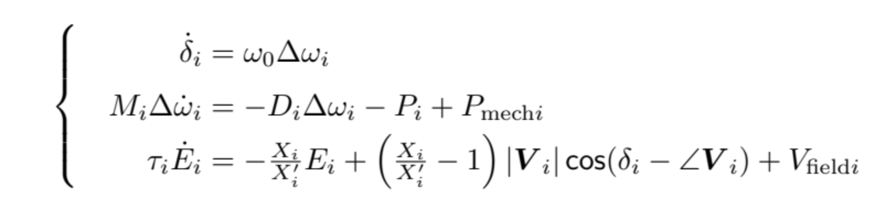
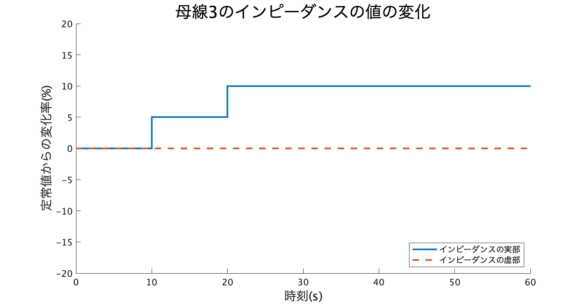
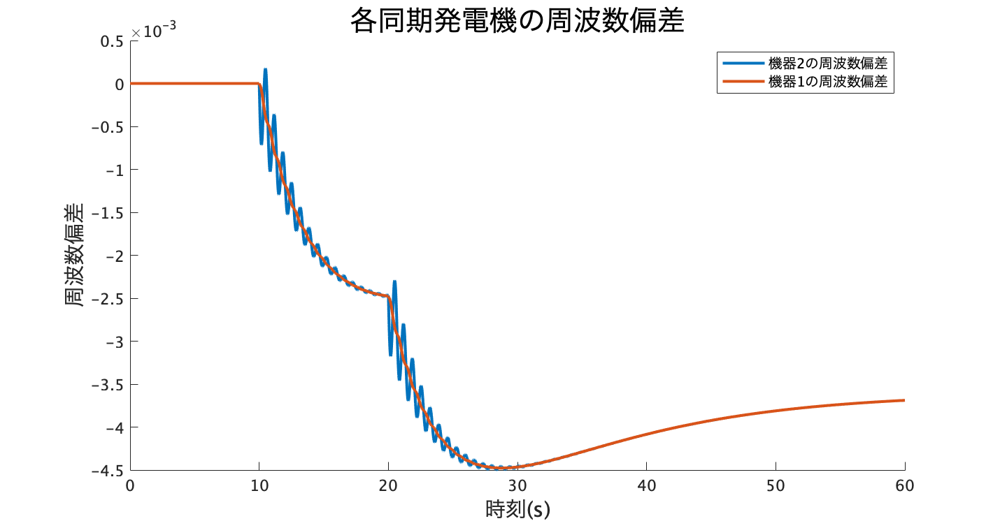
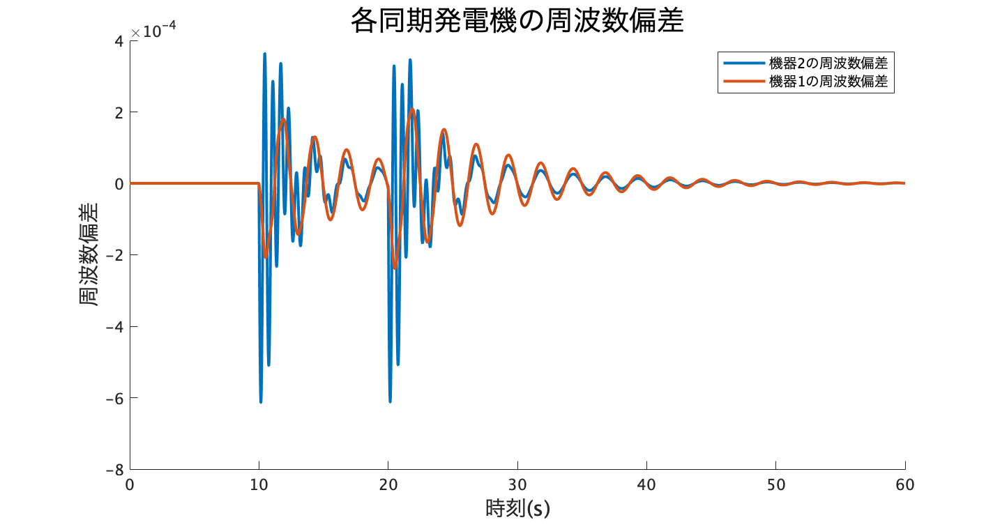
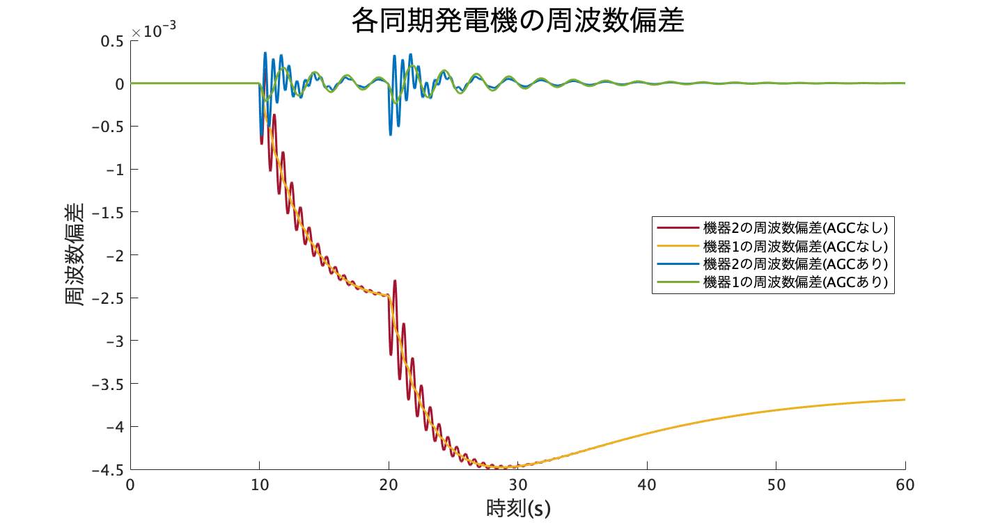

# <div style="text-align: center;"><span style="font-size: 130%; color: black;">簡単なモデルを用いた一連の解析</span></div>

***
このページでは、テキストで扱われていた3busシステムを実際にGUILDA上に実装し、シミュレーションを行ってみます。定義してから解析するまでの流れが１本のストーリーとなるよう構成していますので、順番に読み進めながら手元でも実行してみると理解が深まると思います！  

## <div style="text-align: center;"><span style="font-size: 120%; color: black;">__【本ページの流れ】__</span></div>

1. 3busの電力系統モデルをGUILDA上に実装する
      - `power_network`クラスの定義 [[jump](#power_network)]
      - `branch`クラスの定義および`power_network`クラスへの代入 [[jump](#branch)]
      - `bus`クラスの定義および`power_network`クラスへの代入 [[jump](#bus)]
      - `component`クラスの定義および`bus`クラスへの代入 [[jump](#component)]
2. シミュレーションの実行
      - シミュレーションの条件定義 [[jump](#_6)]
      - 解析の実行と条件設定 [[jump](#_7)]
      - 解析結果のプロット [[jump](#_8)]
3. 電力系統モデルに制御器を組み込む
      -  `controller`クラスの定義および`power_network`クラスへの代入 [[jump](#controller)]
4. シミュレーションの再実行
      - ２と同様の条件で解析を行った際の結果 [[jump](#_10)]
      - 制御器の有無による応答の比較 [[jump](#_11)]

といった流れで進めていきます。

## <div style="text-align: center;"><span style="font-size: 120%; color: black;">__【電力系統モデルの構築】__</span></div>

今回は下図に示された3busのみで構成された電力系統システムを作成します．


---

### <span style="color: Navy; ">__・power_networkクラスの定義__</span>
では、まず電力系統モデルの大枠となる`power_network`クラスを定義します。このクラスには、各母線やブランチ、機器などの情報を整理して格納しておく`properties`と、それらのデータを用いてシミュレーション等の解析を行う`method`が定義されています。この大枠に以下ではデータを代入します。  
`power_network`クラスの定義は簡単で以下のように実行するだけです。

```matlab
net = power_network();
```

### <span style="color: Navy; ">__・branchクラスの定義__</span>
__情報の整理__<br>
次に送電線(ブランチ)の情報を整理します。GUILDAでは送電線の種類として、π型回路モデルの送電線(`branch_pi`クラス)と、さらに位相調整変圧器も含む送電線(`branch_pi_transfer`クラス)の2種類を実装しています。今回は送電線上に位相調整変圧器は含まれないと仮定します。  
実装するモデルには「母線1-母線2」と「母線2-母線3」の２本の送電線が存在します。それぞれの送電線上のインピーダンスと対地静電容量の値は以下とします。

|ブランチが接続している母線|ブランチ上のインピーダンス|対地静電容量|
|:---:|:---:|:---:|
|母線1ー母線2|<span style="font-size: 100%; color: red;"> x12 = 0.010 + 0.085j</span>|<span style="font-size: 100%; color: red;">b12 = 0</span>|
|母線2ー母線3|<span style="font-size: 100%; color: red;"> x23 = 0.017 + 0.092j</span>|<span style="font-size: 100%; color: red;">b23 = 0</span>|

__GUILDA上への実装方法__<br> 
送電網の定義手順は、以下のようになります。

1. 送電網の情報を代入した`branch`クラスの変数を各送電網ごとに定義する。<br>定義方法：`branch_pi(from,to,[xreal,ximag],b);`
      - `from` , `to` : 送電線が繋ぐ母線番号
      - `xreal`, `x_imag` : インピーダンスの実部、虚部
      - `b` : 対地静電容量
2. 生成した`branch`クラスの変数を`power_network`クラスの`add_branch`というmethodを用いて代入する。

では実際に代入しましょう。

```matlab
%母線1と母線2を繋ぐ送電線の定義
branch12 = branch_pi(1,2,[0.010,0.085],0);
net.add_branch(branch12);
%母線2と母線3を繋ぐ送電線の定義
branch23 = branch_pi(2,3,[0.017,0.092],0);
net.add_branch(branch23);
```

送電網の定義について詳しくは[系統モデルの作成ページ](../Reference/define/../defineNet/NewPowerNetwork.md)を参照してください


### <span style="color: Navy; ">__・busクラスの定義__</span>
__情報の整理__<br>
次に、母線の種類（PV,PQ,slack）と各母線の潮流設定の値を決定します。  
今回は以下のように設定してみます。

|母線番号|各母線の潮流設定値|母線の種類|
|:---:|:---:|:---:|
|母線１|<span style="font-size: 100%; color: red;">｜V｜ =2.0 , ∠V＝0.0 </span>|slack母線|
|母線２|<span style="font-size: 100%; color: red;"> P = 0.5 , ｜V｜=2 </span>|PV母線|
|母線３|<span style="font-size: 100%; color: red;"> P = -3 , Q = 0 </span>|PQ母線|

表中のP、Q、|V|、∠V はそれぞれ「有効電力」「無効電力」「母線電圧の大きさ」「電圧の偏角」を指しています。母線の種類や潮流設定の各パラメータの意味に関しては[「電力ネットワークの解説ページ」](../aboutPowerSystem/0TopPage.md)を参考にして下さい。<br>

__GUILDA上での実装方法__<br>

母線の定義についても、送電線の定義と同様に`bus`クラスの変数を定義し、`power_network`クラスの`add_bus`というmethodを用いて代入します。また、`bus`クラスには`bus_PV`、`bus_PQ`、`bus_slack`という子クラスが定義されており各母線の種類ごとにこれらを使い分けて定義します。

1. slack母線の場合:`bus_i = bus_slack(Vabs,Vangle,shunt);`
2. PV母線の場合:`bus_i = bus_PV(P,Vabs,shunt);`
3. PQ母線の場合:`bus_i = bus_PQ(P,Q,shunt);`

各関数の引数については[電力系統モデルの作成ページ](../Reference/defineNet/NewPowerNetwork.md)」を参照してください。それでは、実際に各母線の情報を定義していきます。

```matlab
shunt = [0,0];
%母線1の定義
bus_1 = bus_slack(2,0,shunt);
net.add_bus(bus_1);
%母線2の定義
bus_2 = bus_PV(0.5,2,shunt);
net.add_bus(bus_2);
%母線3の定義
bus_3 = bus_PQ(-3,0,shunt);
net.add_bus(bus_3);
```

ここでの注意点は、`power_network`は母線番号を`add_bus`で定義された順番で管理している点です。母線を定義する際は母線番号の順番に代入していってください。

### <span style="color: Navy; ">__・componentクラスの定義__</span>
__情報の整理__<br>
次に今回実装する3busモデルの各母線に付加する機器を決めます。今回のモデルでは母線1と母線2が発電機バス(slack母線とPV母線)、母線3が負荷母線(PQ母線)となっています。また、今回の実行例では、発電機母線に接続するのは同期発電機の1軸モデル、負荷母線に接続するのは定インピーダンスモデルの負荷とします。同期発電機の1軸モデルは下式のようになっています。  
<br>
  
<br>
同期発電機モデルを適応する場合は、上式の各パラメータを決定する必要があります。以上の情報をまとめると下の表のようになります。

|母線|機器の種類|q軸/d軸の</br>同期リアクタンス|d軸の</br>過渡リアクタンス|d軸の</br>界磁回路の時定数|慣性定数|制動係数|
|:---:|:---:|:---:|:---:|:---:|:---:|:---:|
|母線１|同期発電機(1軸モデル)|<span style="color: red;">Xd =1.569<br>Xq =0.963</span>|<span style="color: red;">Xd_prime =0.963 </span>|<span style="color: red;">T =5.14 </span>|<span style="color: red;">M =100 </span>|<span style="color: red;">D =2 </span>|
|母線２|同期発電機(1軸モデル)|<span style="color: red;">Xd =1.220<br>Xq =0.667</span>|<span style="color: red;">Xd'=0.667 </span>|<span style="color: red;">T =8.97 </span>|<span style="color: red;">M =12 </span>|<span style="color: red;">D =10 </span>|
|母線3|定負荷モデル||||||

なお、同期発電機のパラメータの内、MATLABに実装できる変数名の制約により、そのまま書けない変数名は以下のように書き換えて表現しています。
<div style="text-align: center;">Xd'→ "Xd_prime"<br>τd→　"T"</div>  

__GUILDA上への実装方法__<br>
機器の定義についても、母線の定義と同様に`component`クラスの変数を定義し、それを系統に代入します。ただ、機器の定義は、送電網や母線のように`power_network`クラスに代入するのではなく、`power_network`クラスに代入されている、`bus`クラスに代入します。機器は各母線ごとに接続されているためです。<br>
また、同期発電機の1軸モデルは`generator_1axis`というクラスで定義されています。また定インピーダンスモデルは`load_impedance`というクラスで定義しています。それでは実際に系統に機器モデルを代入していきます。

```matlab
%系統周波数の定義
omega0 = 60*2*pi;

%母線1に同期発電機の1軸モデルを付加
Xd = 1.569; Xd_prime = 0.963; Xq = 0.963; T = 5.14; M = 100; D = 10;
mac_data = table(Xd,Xd_prime,Xq,T,M,D);
component1 = generator_1axis( omega0, mac_data);
net.a_bus{1}.set_component(component1);

%母線2にも同期発電機の1軸モデルを付加
Xd = 1.220; Xd_prime = 0.667; Xq = 0.667; T = 8.97; M = 12; D = 10;
mac_data = table(Xd,Xd_prime,Xq,T,M,D);
comp2 = generator_1axis( omega0, mac_data);
net.a_bus{2}.set_component(comp2);

%母線3には定インピーダンスモデルを付加
comp3 = load_impedance();
net.a_bus{3}.set_component(comp3);
```

ここでの注意点は、generator_1axisの引数のtable型変数の定義についてです。generator_1axisは引数で与えられたテーブル型の変数から、対応する列名の値を抽出していいるため、各パラメータの変数名はコード例と同じになるようにしてください。

<br>
以上で電力系統モデルの定義ができました。最後に

```matlab
net.initialize;
```  
と実行します。これは`power_network`クラス内に定義された`initialize`というmethodを実行しており、プロパティに代入されたパラメータから潮流計算を行い、系統全体のシステムの平衡点を計算し、各値を新たなプロパティとして保存する関数です。これらの値はワークスペースから閲覧することができます。各パラメータの見方は、「[power_networkクラスのデータ構造](../SourceCode/NetProperties.md)」のページを参考にしてください。
---
---
## <div style="text-align: center;"><span style="font-size: 120%; color: black;">__【アドミタンス行列の導出】__</span></div>
テキストではブランチのパラメータをもとにアドミタンス行列を求めていました。ここでも試しにシュミレータを使って求めてみましょう。  
以下のように実行するとアドミタンス行列が求まります。
```matlab
>> net.get_admittance_matrix
ans =
   (1,1)      1.3652 -11.6041i
   (2,1)     -1.3652 +11.6041i
   (1,2)     -1.3652 +11.6041i
   (2,2)      3.3074 -22.1148i
   (3,2)     -1.9422 +10.5107i
   (2,3)     -1.9422 +10.5107i
   (3,3)      1.9422 -10.5107i
```
この様な出力が出てくると思います。アドミタンス行列は一般的に疎行列となり、このように行列内の非零の要素の(行,列)とその要素の値を並べた表として出力しています。  
行列表示にしたい場合は以下のように実行します。

```matlab
>> full(net.get_admittance_matrix)
ans =
   1.3652 -11.6041i  -1.3652 +11.6041i   0.0000 + 0.0000i
  -1.3652 +11.6041i   3.3074 -22.1148i  -1.9422 +10.5107i
   0.0000 + 0.0000i  -1.9422 +10.5107i   1.9422 -10.5107i
```
因みに、潮流計算にアドミタンス行列が必要なことから分かるように、この`get_admittance_matrix`という関数は先程解説した`initialize`という関数の計算内部でも使われています。
---
---

## <div style="text-align: center;"><span style="font-size: 120%; color: black;">__【シミュレーションの実行】__</span></div>
では、ここまでで電力系統モデルをGUILDA上に定義できたので、このモデルを使って実際にシミュレーションを実行してみましょう。

### <span style="color: Navy; ">__・シミュレーションの条件設定__</span>
今回は、「母線３の負荷が大きくなった際の母線1と母線２の同期発電機の周波数偏差の応答」を観察してみます。ではシミュレーションの設定条件を以下にまとめます。

|解析時間|負荷の変化するタイミング|負荷の変化|
|:---:|:---:|:---:|
|0~60秒|10秒<br>20秒|１回目の変化(10秒時点)：インピーダンス値の実部が 5%増加<br>２回目の変化(20秒時点)：インピーダンス値の実部が10%増加|

つまり負荷の変化率が以下のような場合を考えます。  
<br>


### <span style="color: Navy; ">__・解析の実行__</span>
では、上記のような条件でシミュレーションを実行します。ここでは、実行コードのみ紹介します。条件設定方法の詳細な解説や、他の条件設定に関しては、リファレンスの「[シミュレーションの実行](../Reference/Analysis/net_simulate.md)」のページを参考にしてください。

```matlab
time = [0,10,20,60];
u_idx = 3;
u     = [0, 0.05, 0.1, 0.1;...
         0,    0,   0,   0];

out1 = net.simulate(time,u, u_idx);
```

### <span style="color: Navy; ">__・解析結果のプロット__</span>
上記のように実行すると解析が開始され、コマンドウィンドウに解析進行度が表示されます。解析が終了したら、出力結果を見てみましょう。今回は母線1と母線2の周波数偏差を見たいため、出力(`out1`)の中の`X`というフィールドに着目します。母線1,2に付加した`generator_1axis`モデルの実装コード内では、状態を「回転子偏角δ,周波数偏差Δω,内部電圧E」という順で実装しているため、今回は２番目の状態の応答を見れば良いということになります。出力結果のデータの読み取り方は「[シミュレーションの実行](../Reference/Analysis/net_simulate.md)」のページを参考にしてください。では実際に結果をプロットしてみます。  

```matlab
%データ抽出
sampling_time = out1.t;
omega1 = out1.X{1}(:,2);
omega2 = out1.X{2}(:,2);

%プロット
figure;
hold on;
plot(sampling_time, omega2,'LineWidth',2)
plot(sampling_time, omega1,'LineWidth',2)
xlabel('時刻(s)','FontSize',15);
ylabel('周波数偏差','FontSize',15);
legend({'機器2の周波数偏差','機器1の周波数偏差'})
title('各同期発電機の周波数偏差','FontSize',20)
hold off
```

<div align="center">

</div>

この結果を見ると負荷のインピーダンス値が上がる10秒の時点と20秒の時点で周波数偏差が大きく変化していることが分かります。系統全体で需給バランスが取れていた潮流状態から、負荷の消費電力が増加し需給バランスが取れなくなったためです。周波数偏差が非零の状態で電力供給を行い続けるのは、電力品質が良いとは言えませんし精密な機器を扱う工場等にとっては大問題です。そのため、現実の電力系統運用では制御器を組み込み周波数偏差を0に戻すようにしています。次の章ではAGCというコントローラを電力系統モデルに組み込んでみます。

## <div style="text-align: center;"><span style="font-size: 120%; color: black;">__【制御器の導入】__</span></div>
今回は電力モデルにAGCを付加することを考えます。AGCは系統全体もしくは一部のエリアに属した同期発電機から周波数偏差の値を観測し、系統全体の需給バランスを整えるよう各発電機へ機械入力(`Pmech`)の指令値を発信するPIコントローラです。
### <span style="color: Navy; ">__・controllerクラスの定義__</span>
GUILDAではAGCを`controller_broadcast_PI_AGC`というクラス名で定義しています。

- 定義方法：`controller_broadcast_PI_AGC(net,y_idx,u_idx,Kp,Ki)`;
      - `net`:付加する電力系統モデル
      - `y_idx`:観測する機器のインデックス
      - `u_idx`:指令値を与える機器のインデックス
      - `Kp,Ki`:PIコントローラの各ゲイン  

今回は母線1,2に接続された同期発電機群を観測対象、かつ入力対象とします。そのため、`y_idx=1:2`と`u_idx=1:2`となります。その他の設定方法について詳細は、「[リファレンス](../Reference/Analysis/net_simulate.md)」のページを参考にしてください。では実際にGUILDA上で実装してみましょう。

```matlab
%AGCコントローラを定義
con = controller_broadcast_PI_AGC(net,1:2,1:2,-10,-500);

%電力系統にcontrollerクラスを代入
net.add_controller_global(con);
```

## <div style="text-align: center;"><span style="font-size: 120%; color: black;">__【シミュレーションの再実行】__</span></div>
では、制御器を付加した系統モデルで先程と同様のシミュレーション行ってみます。
```matlab
%解析実行
out2 = net.simulate(time,u, u_idx);

%データ抽出
sampling_time = out2.t;
omega1 = out2.X{1}(:,2);
omega2 = out2.X{2}(:,2);

%プロット
figure;
hold on;
plot(sampling_time, omega2,'LineWidth',2)
plot(sampling_time, omega1,'LineWidth',2)
xlabel('時刻(s)','FontSize',15); 
ylabel('周波数偏差','FontSize',15);
legend({'機器2の周波数偏差','機器1の周波数偏差'})
title('各同期発電機の周波数偏差','FontSize',20)
hold off

```
<div align="center">

</div>

上の結果を見ると、負荷が増大する10秒,20秒の時点では変わらず振動しているものの、制御器を付加したことで各機器の周波数偏差は0付近に収束する様になったことが分かります。

### <span style="color: Navy; ">__・制御器を付ける前と後の比較__</span>

最後に制御器を付加する前と付加した後の結果を比較してみます。下の図は上の２つの結果を同じスケール上にプロットしたものです。同じ負荷の変動に対して、AGCを付加した場合の方が大幅に周波数偏差を抑制していることが明らかに見て取れます。つまりAGCコントローラが系統全体の需給バランスを調整し、周波数偏差を抑制できているということが分かりました。
<div align="center">

</div>

<br><br>
解説は以上になります。

---

いかがでしたでしょうか？本ページでは一連の解析の様子を解説してきました。GUILDAでは

- まず「電力系統モデルを実装する」
- そして「作成した系統モデルに制御器を組み込む」
- 最後に「それらの系統モデルにたいして条件設定をしてシミュレーションを行う」  

といったことができます。また本シミュレータでは今後様々な電力系統モデルの実装にも対応できるよう、拡張性を配慮した構造になるよう設計されてきました。今回はほんの一例を紹介しましたが、今回とは違った使い方や各クラスについて、さらに詳しく知りたいという場合は、解説中にも所々リンクを載せていましたが「[リファレンス](../Reference/0TopPage.md)」などのページも参考にしてみてください。

---

## <div style="text-align: center;"><span style="font-size: 120%; color: black;">__【サンプルコード全文】__</span></div>
``` matlab
%電力系統のフレームワークを作成
net = power_network;

%ブランチ(branch)の定義
    
    %母線1と母線2を繋ぐ送電線の定義
    branch12 = branch_pi(1,2,[0.010,0.085],0);
    net.add_branch(branch12);
    %母線2と母線3を繋ぐ送電線の定義
    branch23 = branch_pi(2,3,[0.017,0.092],0);
    net.add_branch(branch23);


%母線(bus)の定義
    shunt = [0,0];
    %母線1の定義
    bus_1 = bus_slack(2,0,shunt);
    net.add_bus(bus_1);
    %母線2の定義
    bus_2 = bus_PV(0.5,2,shunt);
    net.add_bus(bus_2);
    %母線3の定義
    bus_3 = bus_PQ(-3,0,shunt);
    net.add_bus(bus_3);

    
%機器(component)の定義
    
    %系統周波数の定義
    omega0 = 60*2*pi;
    
    %母線1に同期発電機の1軸モデルを付加
    Xd = 1.569; Xd_prime = 0.963; Xq = 0.963; T = 5.14; M = 100; D = 10;
    mac_data = table(Xd,Xd_prime,Xq,T,M,D);
    component1 = generator_1axis( omega0, mac_data);
    net.a_bus{1}.set_component(component1);
    
    %母線2にも同期発電機の1軸モデルを付加
    Xd = 1.220; Xd_prime = 0.667; Xq = 0.667; T = 8.97; M = 12; D = 10;
    mac_data = table(Xd,Xd_prime,Xq,T,M,D);
    comp2 = generator_1axis( omega0, mac_data);
    net.a_bus{2}.set_component(comp2);
    
    %母線3には定インピーダンスモデルを付加
    comp3 = load_impedance();
    net.a_bus{3}.set_component(comp3);


%潮流計算の実行
net.initialize


%余談 ~アドミタンス行列の導出~
full(net.get_admittance_matrix)


%シミュレーションの実行(制御器なしver)
   
    %条件設定
    time = [0,10,20,60];
    u_idx = 3;
    u = [0, 0.05, 0.1, 0.1;...
         0,    0,   0,   0];
    
    %入力信号波形プロット
    figure; hold on;
    u_percent = u*100;
    stairs(time,u_percent(1,:),'LineWidth',2)
    stairs(time,u_percent(2,:),'--','LineWidth',2)
    xlabel('時刻(s)','FontSize',15); 
    ylabel('定常値からの変化率(%)','FontSize',15);
    ylim([-20,20])
    legend({'インピーダンスの実部','インピーダンスの虚部'},'Location','southeast')
    title('母線3のインピーダンスの値の変化','FontSize',20)
    hold off;
    
    %解析実行
    out1 = net.simulate(time,u, u_idx);
   
    %データ抽出
    sampling_time = out1.t;
    omega1 = out1.X{1}(:,2);
    omega2 = out1.X{2}(:,2);
    
    %プロット
    figure; hold on;
    plot(sampling_time, omega2,'LineWidth',2)
    plot(sampling_time, omega1,'LineWidth',2)
    xlabel('時刻(s)','FontSize',15); 
    ylabel('周波数偏差','FontSize',15);
    legend({'機器2の周波数偏差','機器1の周波数偏差'})
    title('各同期発電機の周波数偏差','FontSize',20)
    hold off

%電力系統に制御器を付加 

    %AGCコントローラを定義
    con = controller_broadcast_PI_AGC(net,1:2,1:2,-10,-500);
    
    %電力系統にcontrollerクラスを代入
    net.add_controller_global(con);


%シミュレーションの実行(制御器ありver)
    
    %解析実行
    out2 = net.simulate(time,u,u_idx);
    
    %データ抽出
    sampling_time = out2.t;
    omega1 = out2.X{1}(:,2);
    omega2 = out2.X{2}(:,2);
    
    %プロット
    figure; hold on;
    plot(sampling_time, omega2,'LineWidth',2)
    plot(sampling_time, omega1,'LineWidth',2)
    xlabel('時刻(s)','FontSize',15); 
    ylabel('周波数偏差','FontSize',15);
    legend({'機器2の周波数偏差','機器1の周波数偏差'})
    title('各同期発電機の周波数偏差','FontSize',20)
    hold off

%制御器を付ける前と後の比較のプロット
    figure; hold on;
    plot(out1.t, out1.X{2}(:,2),'Color','#A2142F','LineWidth',1.5)
    plot(out1.t, out1.X{1}(:,2),'Color','#EDB120','LineWidth',1.5)
    plot(out2.t, out2.X{2}(:,2),'Color','#0072BD','LineWidth',1.5)
    plot(out2.t, out2.X{1}(:,2),'Color','#77AC30','LineWidth',1.5)
    xlabel('時刻(s)','FontSize',15); 
    ylabel('周波数偏差','FontSize',15);
    legend({'機器2の周波数偏差(AGCなし)','機器1の周波数偏差(AGCなし)',...
                '機器2の周波数偏差(AGCあり)','機器1の周波数偏差(AGCあり)'},...
                'Location','east')
    title('各同期発電機の周波数偏差','FontSize',20)
    hold off
```