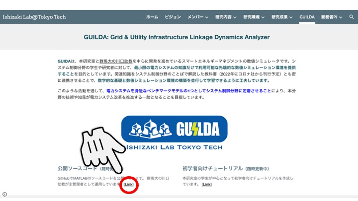
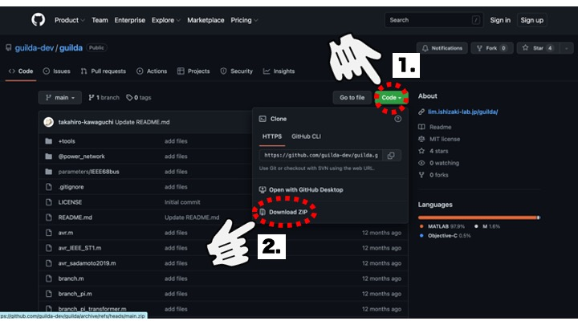
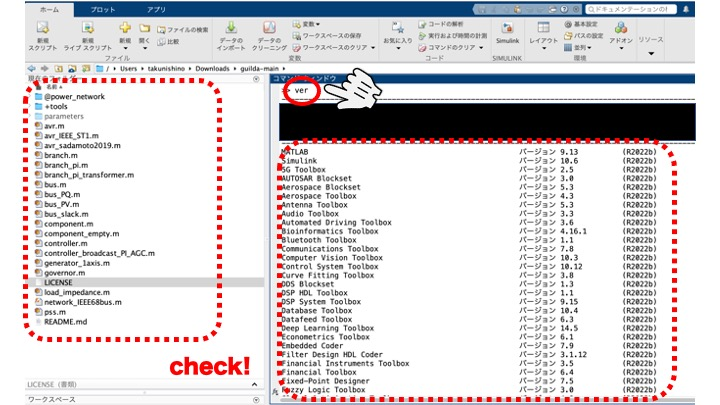
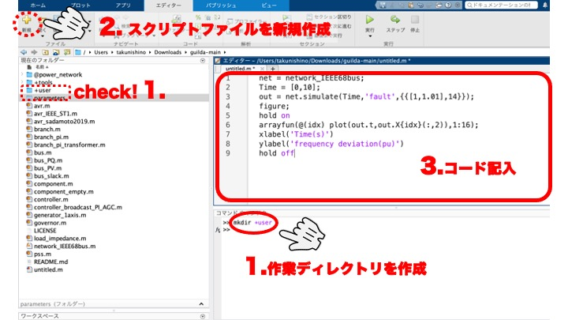
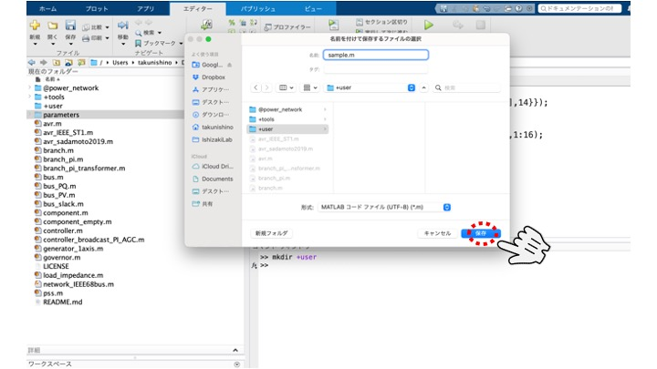
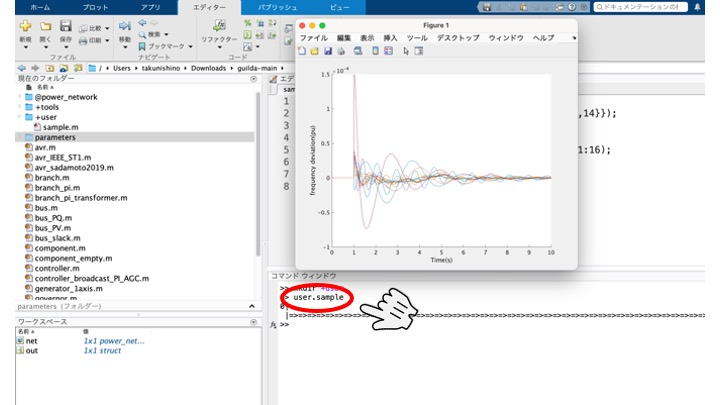

# <div style="text-align: center;"><span style="font-size: 130%; color: black;">GUILDA環境設定</span></div>

---

### <div style="text-align: center;"><span style="font-size: 130%; color: black;">【GUILDAソースコードのダウンロード】</span></div>

GUILDAのソースコードはGit上で一般公開しています。リンクは石崎研究室HPの[GUILDA紹介サイト](https://lim.ishizaki-lab.jp/guilda)から飛べるようになっているのでそちらをご利用ください。  
Gitリポジトリからのダウンロードに関しては、クローンして管理して頂く方法もありますが、ここでは簡単に行えるzipファイルとしてローカルのパソコンに保存する手順を紹介しておきます。基本的には以下の画像の様にクリックしていただければダウンロードまで出来ると思います。  
<div style="text-align: center;">

</div>

<div style="text-align: center;">

</div>

---
***

<div style="text-align: center;">

</div>

### <div style="text-align: center;"><span style="font-size: 130%; color: black;">【MATLABでの操作】</span></div>

<br>
では、実際にソースコードをMATLAB上で開いて環境を整えていきましょう。先程ダウンロードしたソースコードのzipファイルを展開し、そのディレクトリまで移動します。下の画像のように「現在フォルダ(window内左半分)」のエリアに`@power_network`などのディレクトリがあればOKです！  
ついでにGUILDAに必要なToolBoxがインストールされているかも確認しておきます。コマンドウィンドウに`ver`と入れ、GUILDA内で使われている関数に必要なToolBoxがあるか確認しておきましょう。必要なToolBoxは以下の３つになります。足りないものがあれば「アドオン」ボタン(window右上)からインストールしましょう。

- Optimization Toolbox
- Control System Toolbox
- Robust Control Toolbox  

<div style="text-align: center;">

</div>
これでGUILDAの環境設定は完了です！  
以下では実際に解析をしていく際の様子を説明しています。MATLABの操作にまだあまり慣れていない方は参考にしてみてください！

<br><br>

## <div style="text-align: center;"><span style="font-size: 150%; color: black;">【実際の作業プロセスの様子】</span></div>

解析をする際は先程の`ver`を打ち込んだように、コマンドウィンドウに１行づつ打っても構いませんが、一連の解析作業を行う際はスクリプトファイルにまとめて記述した方が作業内容の保存もできるのでお薦めです。  

- ファーストステップとして、  
  自身の作業ディレクトリを作っておきます。自身の作成したコードとソースコードが混ざると一覧性が悪くなるのでディレクトリに分けてコード作成をすることをおすすめします。ここでは`+user`というディレクトリを作ります。
  ```matlab
  %実行コマンド
  mkdir +user
  ```
  ディレクトリ名は何でも良いですが __必ず頭文字に`"+"`を入れてください__ 。こうすることでこのディレクトリ配下のmファイルにもパスが通り、現在フォルダのmファイルだけでなく、`+user`フォルダの配下のmファイルも実行できるようになります。

- 次に、  
  新しくスクリプトファイルを作ります。window内左上の「新規(スクリプトファイル)」を押すとエディターに新たなファイルが起動されます。
- 新しく開いたスクリプトファイルに自身が行いたい解析内容のコードを記入します。本チュートリアルの解説内容は、主にこのエリアに記入するコードの書き方になります。
<div style="text-align: center;">

</div>
<br>
では、作成したスクリプトファイルを保存し実際に実行してみます。  
今回は例として'sample.m'という名前でこのスクリプトファイルを保存します。
<div style="text-align: center;">

</div>
<br>

「現在フォルダー」のエリア(window左半分)を見ると`+user`の配下に`sample.m`が生成されていることが分かります。上のタブにある「実行」ボタンを押し解析を始めます。
<div style="text-align: center;">

</div>
<br>

上記の様に「実行」ボタンを押して解析を行うのも良いですが、コマンドで動かしたい場合は'user.sample'と実行します。これは./+user/sample.m 実行するというコマンドであり、先程お伝えしたようにディレクトリ名の頭文字に`"+"`を入れておくと、`(そのディレクトリ名).(ファイル名)`として実行できるようになります。便利なので是非使ってみてください！  

``` matlab
  %実行コマンド
  user.sample
```
<div style="text-align: center;">

</div>

この様に解析が実行できました！  
<br>
ちなみにここで行った解析内容は、

```
IEEE68busモデルの14番目の母線に[1~1.01]秒の間地絡が起きた際の、
各発電機(1~16番目の母線に接続)の[0~10]秒での周波数偏差の応答
```

をプロットした例でした。
