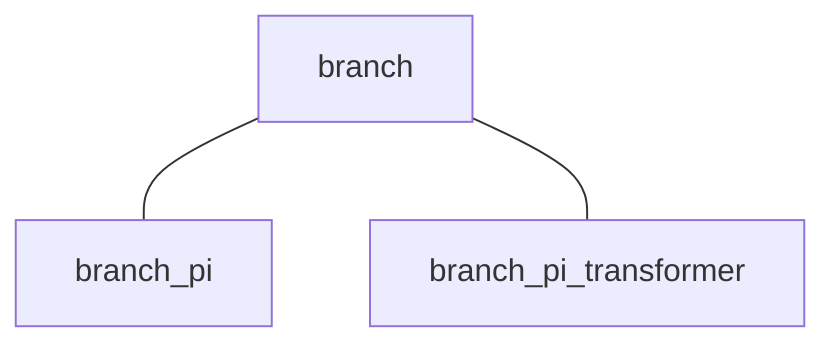

## 電力系統モデルについて取り扱っているチュートリアル

- [電力系統モデルの構成機器](../aboutPowerSystem/0TopPage.md)
- [一連の解析実行例](../SeriesAnalysis/0TopPage.md)
- [新たな電力系統モデルの定義](../Reference/defineNet/NewPowerNetwork.md)

## *branch* クラスの全体像

まずは母線に関するクラスの全体像を示します。

## **branch**

全てのBranchクラスの基底クラス．

### メンバ変数
- from,to：送電線が繋ぐ母線の番号

### メンバ関数(抽象メソッド)
- **`y = get_admittance_matrix(obj);`**  
    アドミタンス行列を生成するための関数

## **branch_pi**

対地静電容量をもつ送電線のπ型回路モデルの実装（ ***branch*** クラスの派生クラス）

### メンバ変数
- x：送電網上のインピーダンス
- y：送電網がもつ対地静電容量

### コンストラクタメソッドの使用方法
- **`obj = branch_pi(from, to, x, y)`**  
    引数に関しては上のメンバ変数を参照。

## **branch_pi_transformer**

対地静電容量をもつ送電線のπ型回路モデルに位相調整変圧器が組み込まれたモデルの実装（ ***branch*** クラスの派生クラス）

### メンバ変数
- x：送電網上のインピーダンス
- y：送電網がもつ対地静電容量
- tap：変圧器のゲイン
- phase：変圧器の位相差

### コンストラクタメソッドの使用方法
- **`obj = branch_pi_transformer(from, to, x, y, tap, phase)`**  
    引数に関しては上のメンバ変数を参照。
