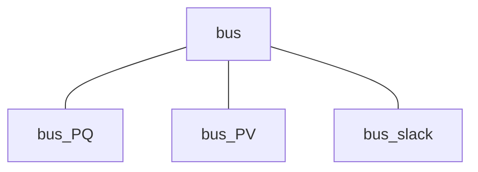

## 電力系統モデルについて取り扱っているチュートリアル

- [電力系統モデルの構成機器](../aboutPowerSystem/0TopPage.md)
- [一連の解析実行例](../SeriesAnalysis/0TopPage.md)
- [新たな電力系統モデルの定義](../Reference/defineNet/NewPowerNetwork.md)

## *bus* クラスの全体像

まずは母線に関するクラスの全体像を示します。

## **bus**

全てのBusクラスの基底クラス．

### メンバ変数
- component：繋がれた機器のインスタンス
- V_equilibrium：母線の電圧の平衡点（複素数値）
- I_equilibrium：母線の電流の平衡点（複素数値）
- shunt：母線と地面とのシャント抵抗のインピーダンス（複素数値）

### コンストラクタメソッドの使用方法
- **`set_component(obj, component)`**  
    母線に機器を繋ぐための関数
    - 入力変数 `component`  
        母線に繋ぐ機器のインスタンス  
        例えば、load, controller, generator など

## **bus_PQ**

PQ Busの実装（ ***bus*** クラスの派生クラス）

### メンバ変数
- P：母線の有効電力
- Q：母線の無効電力

### コンストラクタメソッドの使用方法
- **`obj = bus_PQ(P, Q, shunt)`**  
    有効電力と無効電力を指定する母線、主に負荷の接続される母線に利用
    - 入力引数 `P`：有効電力の指定
    - 入力引数 `Q`：無効電力の指定
    - 入力引数 `shunt`：シャント抵抗値（複素数値）

## **bus_PV**

PV Busの実装（ ***bus*** クラスの派生クラス）

### メンバ変数
- Vabs：母線の電圧の絶対値
- P：母線の有効電力

### コンストラクタメソッドの使用方法
- **`obj = bus_PV(P, V, shunt)`**  
    電圧の絶対値と有効電力を指定する母線、主に発電機の接続される母線に利用  
    - 入力引数 `P`：有効電力の指定
    - 入力引数 `V`：電圧の絶対値の指定
    - 入力引数 `shunt`：シャント抵抗値（複素数値）

## **bus_slack**

slack (swing) Busの実装（ ***bus*** クラスの派生クラス）

### メンバ変数
- Vabs：母線の電圧の絶対値
- Vangle：母線の電圧の位相角

### コンストラクタメソッドの使用方法
- **`obj = bus_slack(Vabs, Vangle, shunt)`**  
    電圧の絶対値と位相角を指定する母線、主に発電機の接続される母線に利用（ネットワークのうちで一つの発電機がslack母線に接続されていなければならない）
    - 入力引数 `Vabs`：電圧の絶対値の指定
    - 入力引数 `Vangle`：電圧の位相角の指定
    - 入力引数 `shunt`：シャント抵抗値（複素数値）
