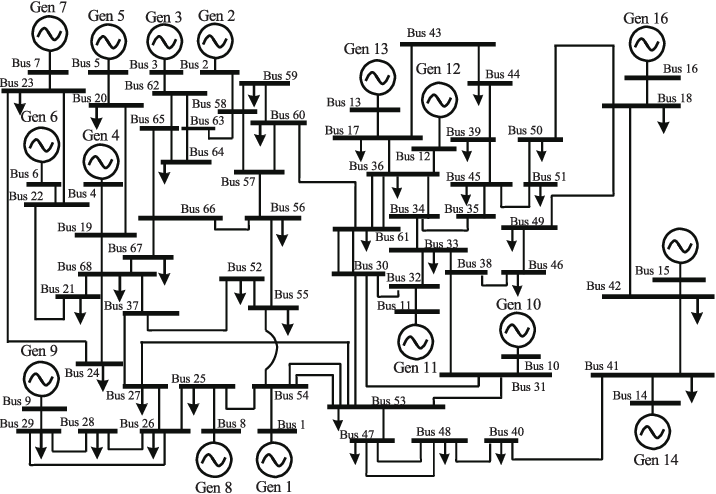

# 電力系統モデルを定義するクラス
## 電力系統モデルについて取り扱っているチュートリアル
- [電力系統モデルの構成機器](../aboutPowerSystem/0TopPage.md)
- [一連の解析実行例](../SeriesAnalysis/0TopPage.md)
- [電力系統モデルの定義](../Reference/defineNet/0TopPage.md)
- [シミュレ−ションの実行](../Reference/Analysis/net_simulate.md)
- [近似線形化モデルの導出](../Reference/Analysis/net_getsys.md)

## **power_network**

全ての電力系統モデルの基底クラス．

### メンバ変数
- x_equilibrium：発電機の内部状態が入った配列 
各発電機ごとに内部状態が回転子偏角δ、角周波数偏差Δω、内部電圧E、AVRの変数、PSSの変数の順に格納されている
- V_equilibrium：各母線の電圧フェーザの平衡点が複素数値で格納された配列
- I_equilibrium：各母線の電流フェーザの平衡点が複素数値で格納された配列
- a_bus：母線情報のセル配列 
i番目の母線の情報はi番目の要素に格納されており、構造体の形で取得出来る 
（例　power_network.a_bus{5}.V_equilibriumで５番目の母線の電圧の平衡点が取得出来る）
- a_controller_global：グローバルコントローラのセル配列
- a_controller_local：ローカルコントローラのセル配列
- a_branch：送電網のセル配列

### メンバ関数
- **`out = simulate(obj, t, varargin)`**
    システムのシミュレーションを行い、その結果を出力する関数
    - 入力変数 `t`  
        シミュレーション時間の設定  
        [start, end]のようにシミュレーションの開始時刻と終了時刻を秒単位で入力  

    残りの入力引数は任意

    - 入力引数 `u`：バスへの入力
    - 入力引数 `idx_u`：入力するバスの指定

    （上２つを設定する場合には、時刻tの直後に入力する必要がある）

    - 入力引数 `options`：
        シミュレーションのオプションを設定する（構造体）

        - linear：線形化を行うか否かの設定
        - fault：地絡の条件 
        {[tstart, tend], idx_fault}というセル配列のセル配列
        - x0_sys：内部状態の初期値の設定 
        バスごとのセル配列あるいは，すべてをスタックしたベクトル
        - V0：母線電圧の初期値を設定 
        バスごとのセル配列あるいは，すべてをスタックしたベクトル
        - I0：母線電流の初期値を設定 
        バスごとのセル配列あるいは，すべてをスタックしたベクトル
        - X0_con_local：ローカルコントローラの初期値の設定 
        コントローラごとのセル配列，あるいは，すべてをスタックしたベクトル
        - x0_con_global：グローバルコントローラの初期値設定 
        コントローラごとのセル配列，あるいは，すべてをスタックしたベクトル
        - rest_time：数値計算(ode)のタイムアウト時間
        - do_retry：数値計算(ode)のタイムアウト時の処理

    - 出力引数 `out` 
    時間応答データが含まれる構造体
        - t：時刻
        - X：母線に繋がれた発電機の状態（母線ごとの配列） 
        母線に発電機以外がつながれている場合は空
        - V：母線の電圧（母線ごとの配列）
        - I：母線の電流（母線ごとの配列）
        - fault_bus：地絡母線の情報
        - U_global：グローバルコントローラが生成した入力（コントローラごとの配列）
        - U：ローカルコントローラが生成した入力（コントローラごとの配列）
        - sols：ode15sが返す解

-  **`add_controller_local(obj, controller)`**  
    - システムにコントローラを追加する関数
    - 入力引数 `controller`  
        controllerクラスのインスタンス  
        ただし、追加するコントローラが指定するバスにすでにコントローラが追加されている場合は、削除してから追加する。

-  **`add_controller_global(obj, controller)`**  
    システムにグローバルコントローラを追加する関数
    - 入力引数 `controller`  
        controllerクラスのインスタンス  
        ただし、コントローラはグローバルコントローラに限る

-  **`remove_controller_local(obj, idx)`**  
    システムのコントローラのうち、指定したバスに追加されているものを削除する関数
    - 入力引数 `idx`：削除するコントローラの追加されているバス

-  **`remove_controller_global(obj, idx)`**  
    システムのグローバルコントローラのうち、指定したバスに追加されているものを削除する関数
    - 入力引数 `idx`：削除するグローバルコントローラの追加されているバス

## **network_IEEE68bus**

**IEEE 68bus 16machine システム**（[引用元](https://www.springer.com/gp/book/9780387259499)）の実装（ ***power_network*** クラスの派生クラス）  
発電機として[generator_1axis]()を，負荷として[load_impedance]() を導入したネットワークである．
<!--
発電機として[generator_1axis](../component/#generator_1axis)を，負荷として[load_impedance](../component/#load_impedance) を導入したネットワークである．  
-->

## **network_sample3bus**

「[一連の解析実行例](../SeriesAnalysis/0TopPage.md)」にて用いた、バス１(発電機バス)、バス２(発電機バス)、バス３(負荷バス)の３つのバスを下の図のようにつないだシステム。細かなパラメータは「[電力系統の定義編](../Reference/defineNet/NewPowerNetwork.md)」を参照。   

 

