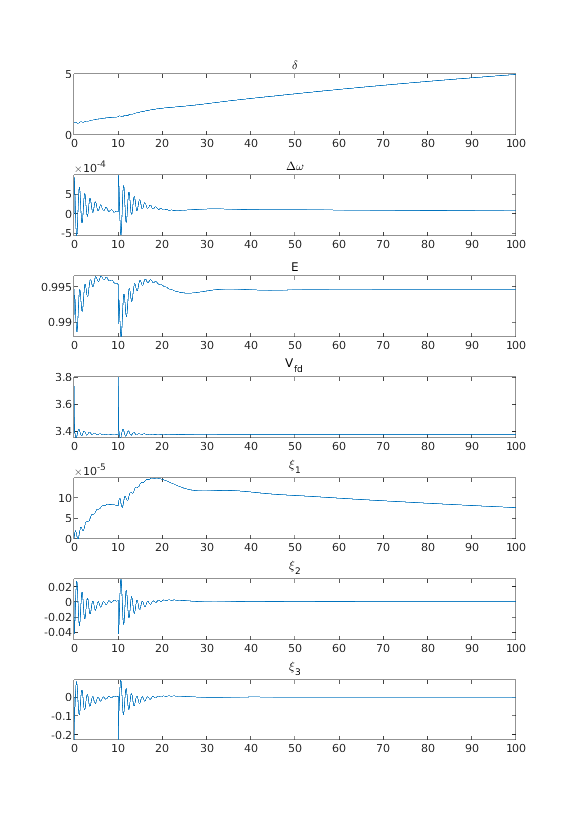
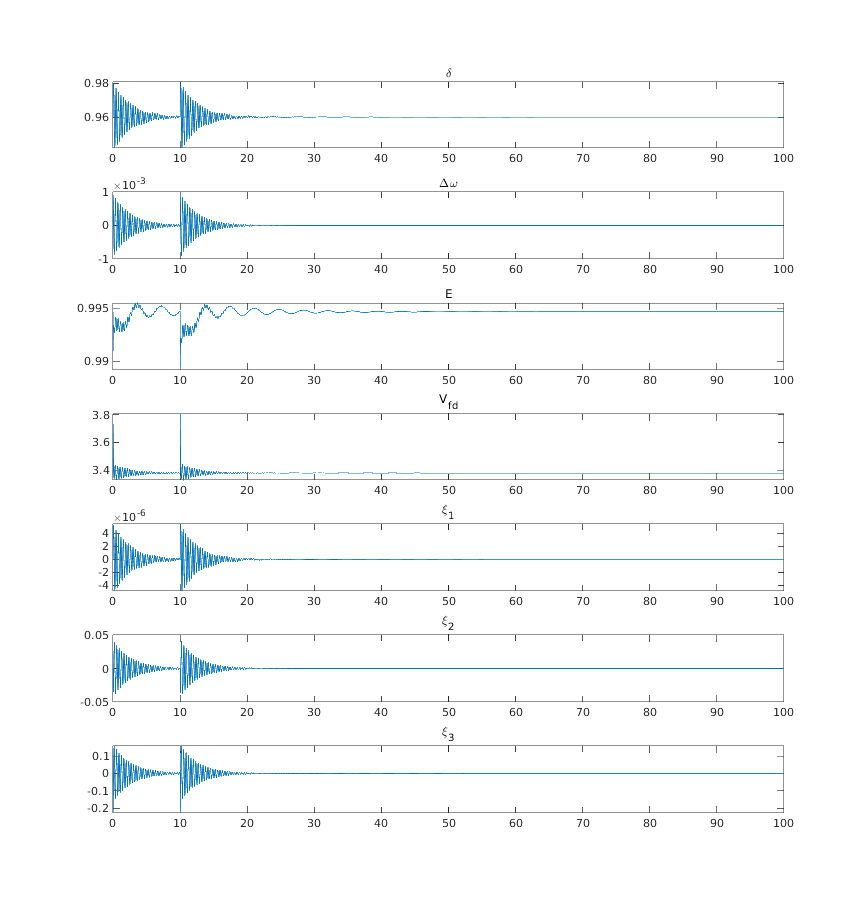

<div style="text-align: center;">

</div>

このチュートリアルではテキストの内容に沿って電力系統システムを自分で定義し，その制御シミュレーションを行う方法を解説します．  

- テキストの第１章で扱われていた3busシステムを定義する。
- 各コンポーネントに実際に発電機や負荷を設置し、具体的なパラメータを代入する。
- 定義した電力モデルの時間応答を解析したり、コントローラを負荷して解析を行う。  

といった流れで進めていこうと思います。

## ___<span style="color: purple;">対象となるシステムの設定</span>___

本チュートリアルにおいては以下の図ような単純な電力系統システムを自作します．


この電力系統システムでは３つのバスと機器が繋がっているシステムです．  
ここで上の３busシステムをシュミレータ上で定義するにあたり、一度情報を表にして以下にまとめてみます。(<span style="font-size: 80%; color: red;">※表中の赤字のパラメータの値は適当に決めています。</span>)

#### ・バスの情報
図からも分かるように、このシステムは３つのバスによって構成されています。

|バス番号|潮流計算のために決定された</br>各バスの定常値|バスの種類|
|:---:|:---:|:---:|
|バス１|<span style="font-size: 100%; color: red;">｜V｜ =1.0 , ∠V＝0.0 </span>|slackバス|
|バス２|<span style="font-size: 100%; color: red;"> P = 1.0 , ｜V｜=1.7 </span>|PVバス|
|バス３|<span style="font-size: 100%; color: red;"> P = -1.25 , Q = -0.5 </span>|PQバス|

表中のP、Q、|V|、∠V はそれぞれ「有効電力」「無効電力」「電圧の大きさ」「電圧の偏角」を指しています。これに関しては[電力ネットワークの解説ページ](../intro_net)でも触れているので参考にして下さい。

#### ・ブランチの情報
このシステムではバス間をつなぐブランチは2本あることが分かります。

|ブランチが接続している<br>バス|ブランチ上のインピーダンス</br>と対地静電容量|位相調整変圧機<br>のパラメータ|
|:---:|:---:|:---:|
|バス１ーバス２|<span style="font-size: 100%; color: red;"> x = 0.0576j<br>y=0 </span>|<span style="font-size: 100%; color: red;">τ=1.0, θ＝0.0</span>|
|バス３ーバス２|<span style="font-size: 100%; color: red;"> x = 0.0625j<br>y=0 </span>|<span style="font-size: 100%; color: red;">τ=1.0, θ＝0.0</span>|

表中のｘの値はブランチ上のインピーダンスの値を指しています。この値の逆数がアドミタンスです。yの値は対地静電容量の値を示しており、テキストではbijと表記されていたパラメータです。  
τとθはテキスト内でも出てきましたが、位相調整変圧器のパラメータであり、以下の解説では`tap`と`phase`という表記になっています。

#### ・同期発電機モデルの情報

今回のシステムでバス１とバス２が発電機バス(slackバスとPVバス)であるためパラメータ設定する必要のある発電機の個数は２つである。

|発電機を付加する<br>バス番号|q軸/d軸の</br>同期リアクタンス|d軸の</br>回路時定数|慣性定数|制動係数|
|:---:|:---:|:---:|:---:|:---:|
|バス１|<span style="color: red;"> Xq =1.59 ,</br> Xd =1.6 , Xd'=0.32 </span>|<span style="color: red;">τｄ =6.0 </span>|<span style="color: red;">M =100 </span>|<span style="color: red;">D =2 </span>|
|バス２|<span style="color: red;"> Xq =1.59 ,</br> Xd =1.6 , Xd'=0.23 </span>|<span style="color: red;">τｄ =6.0 </span>|<span style="color: red;">M =18 </span>|<span style="color: red;">D =2 </span>|

表の各変数の記号はテキストと同じ様にしましたが、シュミレータ内では  
<div style="text-align: center;">Xd'→ Xdp　、　τｄ→ Tdo　、　D→ d</div>  
という変数名になっています。  
なお、発電機を円筒形にしたい場合は、`Xdp`に`Xq`と同じ値を入れます。

#### ・制御器の情報(AVR,PSSなど)

一般に世の中で稼働している発電所の発電機はAVR,PSSなどの制御機が内蔵されています。

本シュミレータでは後にも実行の仕方を触れますが、制御器を内蔵した発電機モデルを定義する関数`generator_AGC`という関数があります。その関数を実行する際に制御器のパラメータも引数として代入します。  
制御器のパラメータのデータは１発電機に１つ必要になるため、今回のシステムでは２つ設定する必要があります。


|制御機を付加する発電機が</br>接続してるバス番号|Ka|Te|Kpss|Tpss|TL|
|:---:|:---:|:---:|:---:|:---:|:---|
|バス１|<span style="color: red;">Ka = 2.0</span>|<span style="color: red;">Te = 0.05</span>|<span style="color: red;">Kpss = 200</span>|<span style="color: red;">Tpss = 10</span>|<span style="color: red;">TL1 = 0.015 , TL1'= 0.05</br>TL2 = 0.01 , TL2'= 0.08</span>|
|バス２|<span style="color: red;">Ka = 2.0</span>|<span style="color: red;">Te = 0.05</span>|<span style="color: red;">Kpss = 200</span>|<span style="color: red;">Tpss = 10</span>|<span style="color: red;">TL1 = 0.015 , TL1'= 0.05</br>TL2 = 0.01 , TL2'= 0.08</span>|
 
といったように先に紹介した3busシステムでもこれだけの情報が割り当てられています。  
それでは実際に以下にこれらの情報をもとにシュミレータ内でこの3busシステムを定義していきましょう。

## ___<span style="color: purple;">電力系統システムの定義</span>___

全ての電力系統システムは`power_network`クラスを用いて実装されます．以下のようにして電力系統クラスを定義します．

```matlab
net = power_network();
```

イメージでいうと、空のテンプレート表のようなものを変数`net`にあてはめており、これからこの表に機器の情報やブランチ・バスの情報を書き込んでいくための準備のようなプロセスです。

### __送電網の定義__

まずは各ブランチ間をつなぐ送電網を定義します．`power_network`クラスには`branch`というメンバー変数があり，そこに送電網に関するパラメーターを定義します．
以下，その定義例です．

```matlab
branch =

  2×7 table

    bus_from    bus_to    x_real    x_imag    y    tap    phase
    ________    ______    ______    ______    _    ___    _____

       1          2         0       0.0576    0     1       0  
       3          2         0       0.0625    0     1       0  
```

```matlab
net.branch = branch;
```
各送電網のパラメーターについては詳しくは[power_network branchについて](path_to_doc_powernetwork_branch)を参照してください


### __バスの定義__

#### ・Slackバス

slackバス(swingバス)とは[潮流計算](https://en.wikipedia.org/wiki/Power-flow_study)のため特別な発電機バスです．

```matlab
net.bus{1} = bus_slack(1.0, 0.0, [0, 0]);
```

引数・各パラメーターについては[bus_slack](path_to_doc_bus_slack)を参照してください．

#### ・Generatorバス

Generatorバスとは発電機(Generator)を接続するためのバスです．プログラム上では以下のように

```matlab
net.bus{2} = bus_PV(1.0, 1.7, [0, 0]);
```
引数・各パラメーターについては[bus_PV](path_to_doc_bus_PV)を参照してください．

#### ・Loadバス

Loadバスとは負荷を接続するためのバスです．プログラム上では以下のように

```matlab
net.bus{3} = bus_PQ(-1.25, -0.5, [0, 0]);
```
引数・各パラメーターについては[bus_PQ](path_to_doc_bus_PQ)を参照してください．

### __機器の定義__

機器を定義し，先程の定義したbusに接続します．プログラム上ではi番目のバスに機器を接続するときは

```matlab
net.bus{i}.add_component(machine);
```
のようにします．

#### ・generator
slackバスとgeneratorには機器としてgeneratorを接続します．
generatorを自作するためには以下のような関数を用います．

```matlab
generator_AGC(mac, exc, pss)
```

各引数,mac,exc,pssはgeneratorのパラメーターに関する[table](https://jp.mathworks.com/help/matlab/tables.html)オブジェクトです．詳しくは，[generator](path_to_doc_generator)を参照してください．

以下，generatorを生成しslackバスに接続するまでのコード例を示します．
```matlab
% mac
Xd = 1.6;
Xdp = 0.32;
Xq = 1.59;
Tdo = 6.0;
M = 100;
d = 2;
mac = table(Xd, Xdp, Xq, Tdo, M, d);

% exc
Ka = 2.0;
Te = 0.05;
exc = table(Ka, Te);

% pss
Kpss = 200;
Tpss = 10;
TL1p = 0.05;
TL1 = 0.015;
TL2p = 0.08;
TL2 = 0.01;
pss = table(Kpss, Tpss, TL1p, TL1, TL2p, TL2);

net.bus{1}.add_component(generator_AGC(mac, exc, pss));
```

#### ・load

power_simulator内には以下の4つのloadが用意されています．

- [load_const_impedance](path_to_load_const_impedance)
- [load_const_power](path_to_load_const_power)
- [load_varying_impedance](path_to_load_varying_impedance)
- [load_varying_power](path_to_load_varying_power)

本チュートリアルにおいては，[load_varying_impedance](path_to_load_varying_impedance)を用います．

```
net.bus{3}.add_component(load_varying_impedance())
```

### __コードのまとめ__
以上のようにして、設定した３busシステムを定義することができました。
ここまでの実行したコマンドをまとめると以下のようになります。  

```matlab
net = power_network();
net.bus = cell(3, 1);

branch_array = [
    1 2	0	0.0576	0	1	0;
    3 2 0	0.0625	0	1	0;
    ];

branch = array2table(branch_array, 'VariableNames', ...
    {'bus_from', 'bus_to', 'x_real', 'x_imag', 'y', 'tap', 'phase'}...
    );

net.branch = branch;
%% slack
net.bus{1} = bus_slack(1.0, 0.0, [0, 0]);

% mac
Xd = 1.6;
Xdp = 0.32;
Xq = 1.59;
Tdo = 6.0;
M = 100;
d = 2;
mac = table(Xd, Xdp, Xq, Tdo, M, d);

% exc
Ka = 2.0;
Te = 0.05;
exc = table(Ka, Te);

% pss
Kpss = 200;
Tpss = 10;
TL1p = 0.05;
TL1 = 0.015;
TL2p = 0.08;
TL2 = 0.01;
pss = table(Kpss, Tpss, TL1p, TL1, TL2p, TL2);

net.bus{1}.add_component(generator_AGC(mac, exc, pss));

%% generator
net.bus{2} = bus_PV(1.0, 1.7, [0, 0]);

% mac
Xd = 1.6;
Xdp = 0.23;
Xq = 1.59;
Tdo = 6.0;
M = 18;
d = 2;
mac = table(Xd, Xdp, Xq, Tdo, M, d);

% exc
Ka = 2.0;
Te = 0.05;
exc = table(Ka, Te);

% pss
Kpss = 200;
Tpss = 10;
TL1p = 0.05;
TL1 = 0.015;
TL2p = 0.08;
TL2 = 0.01;
pss = table(Kpss, Tpss, TL1p, TL1, TL2p, TL2);

net.bus{2}.add_component(generator_AGC(mac, exc, pss));
%% load
net.bus{3} = bus_PQ(-1.25, -0.5, [0, 0]);
net.bus{3}.add_component(load_varying_impedance())
```


---
## ___<span style="color: purple;">アドミタンス行列の導出</span>___
テキストではブランチのパラメータをもとにアドミタンス行列を求めていました。ここでも試しにシュミレータを使って求めてみましょう。  
以下のように実行するとアドミタンス行列が求まります。
```matlab
> net.get_admittance_matrix

ans =
   (1,1)      0.0000 -17.3611i
   (2,1)      0.0000 +17.3611i
   (1,2)      0.0000 +17.3611i
   (2,2)      0.0000 -33.3611i
   (3,2)      0.0000 +16.0000i
   (2,3)      0.0000 +16.0000i
   (3,3)      0.0000 -16.0000i
```
おそらくこの様な出力が出てくると思います。この例だと分かりづらいですがアドミタンス行列は一般的に疎行列となり、このように行列内の非零の要素の(行,列)とその要素の値を並べた表として出力しています。  
行列表示にしたい場合は以下のように実行します。

```matlab
> Y = net.get_admittance_matrix;
> full(Y)

ans =
   0.0000 -17.3611i   0.0000 +17.3611i   0.0000 + 0.0000i
   0.0000 +17.3611i   0.0000 -33.3611i   0.0000 +16.0000i
   0.0000 + 0.0000i   0.0000 +16.0000i   0.0000 -16.0000i
```
因みに、潮流計算にアドミタンス行列が必要なことから分かるように、この関数は次に解説する`initialize`という関数の計算内部でも使われています。

---
## ___<span style="color: purple;">潮流計算の実行</span>___

潮流計算の実行は以下のように行います。
```matlab
net.initialize
```
この関数はコマンドウィンドウ上での出力はありません。  
この関数が実行する計算内容は主に３つあります。

- ブランチの情報からアドミタンス行列を求める。
- 求まったアドミタンス行列を用い設定された各バスの定常値を満たすような電圧・電流フェーザを決定する(潮流計算)。
- 決定されたバスの電流フェーザと電圧フェーザの定常値に整合するように，各発電機の内部電圧や回転子偏角の定常値を求める。

実行結果は変数`net`の中の`x_ss`,`V_ss`,`I_ss`という変数に格納されています。
各データの読み方

- 電圧と電流の定常値：  
`V_ss`と`I_ss`に注目します。それぞれに２×(バス数)だけのデータが格納されていると思います。例えば今回の3busシステムならば６つの要素が格納されます。  
上から順に２つずつ組にしたときi組目の２つの変数はi番目のバスの電圧/電流の定常値の[実部；虚部]を指しています。  
つまり、以下のように変数を変換すると１番目のバスの電圧/電流フェーザの定常値から順に並んだ配列が得られるということになります。

```matlab
Vss = net.V_ss(1:2:end,1) + 1j*net.V_ss(2:2:end,1)
Iss = net.I_ss(1:2:end,1) + 1j*net.I_ss(2:2:end,1)
```

- 発電機の状態の定常値:  
このシュミレータでは発電機の状態ベクトル１つあたりに７つの変数が格納されており、発電機の状態の定常値が格納されている変数`x_ss`は7×(発電機の個数)個の要素を持ちます。  
７変数の状態ベクトルのうち上から３つは順に[回転子偏角(δ);周波数偏差(Δω);内部電圧(E)]を指しています。残りの４つの解説はここでは割愛させていただきます。そのため以下のように実行すれば、回転子偏角と内部電圧の定常値の情報を１番目の発電機から順に並べた表が得られます。
```matlab
>> xss = array2table([net.x_ss(1:7:end,1),net.x_ss(3:7:end,1)],...
    'VariableNames',{'回転子偏角δ', '内部電圧E'})

xss =
  2×2 table
    回転子偏角δ    内部電圧E
    __________    ________
     -0.61669      0.9006 
      0.96019     0.99465 
```

---

## ___<span style="color: purple;">シュミレーションの実行</span>___

自作したシステムに対しシュミレーションを行ってみましょう。  
シュミレーションの実行は`simulate`という関数を用います。入力引数の`option`を設定することで、地絡応答や初期値応答、外乱応答などを行うことができます。ここでは地絡を加えたシミュレーションを実行してみましょう。初期値応答や外乱応答などの他のシュミレーションの実行は[シュミレータベースのTutorial](../withSimulation)を参照して下さい。  

以下がコード例です．

```matlab
option = struct();
option.fault = {{[0, 0.01], 1}, {[10, 10.01], 2}};

out = net.simulate([0, 100], option);
```
ここでは0秒から0.01秒の間にバス１に、10秒から10.01秒の間にバス２にそれぞれ地絡をくわえたときの、0秒から100秒までの時間応答をシュミレーションします。  

シュミレーション結果は変数`out`の中に格納されています。この中のデータの内、例として２つ目のgeneratorのシミュレーション結果をグラフとして表示すると以下のようになります．

```matlab
names = {'\delta', '\Delta\omega', 'E', 'V_{fd}', '\xi_1', '\xi_2', '\xi_3'};
for j = 1:7
    subplot(7, 1, j), plot(out.t, out.X{2}(:, j));
    title(names{j}, 'Interpreter', 'tex');
end
```



## ___<span style="color: purple;">制御器の付加</span>___

power_simulatorで用意している制御器は以下のような様々なものがあります．

- [controller_broadcast_PI_AGC](path_to_doc_controller_broadcast_PI_AGC)
- [controller_broadcast_PI_AGC_normal](path_to_doc_controller_broadcast_PI_AGC_normal)
- [controller_LQR](path_to_doc_controller_LQR)
- [controller_retrofit_generator_UKF](path_to_doc_controller_retrofit_generator_UKF)
- [controller_retrofit_generator_UKF_LQR](path_to_doc_controller_retrofit_generator_UKF_LQR)
- [controller_retrofit_LQR](path_to_doc_controller_retrofit_LQR)

本チュートリアルにおいては[controller_broadcast_PI_AGC_normal](path_to_doc_controller_broadcast_PI_AGC_normal)を用いて制御シミュレーションを行います．地絡などは先程と同じ条件で以下のように制御器をくみこみます．

```matlab
cg = controller_broadcast_PI_AGC_normal(net, [2], [2], -10, -5000);
net.add_controller_global(cg)
```

このように、電力システムにコントローラを付加した後、先程と同じようにシュミレーションを実行し、同様に２つ目のgeneratorのシミュレーション結果をグラフとして表示したものが以下となります．




---
