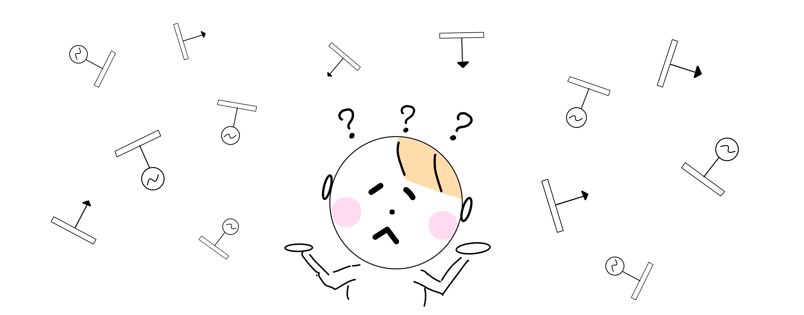
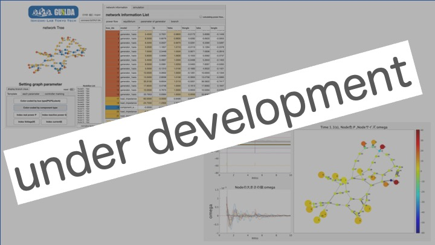

# 
Tutorial TopPage

***
本サイトはGUILDA の公式ドキュメントです.

### 
【GUILDAとは？】

GUIDAは、本研究室と群馬大の川口助教を中心に開発を進めているスマートエネルギーマネジメントの数値シミュレータです。システム制御分野の学生や研究者に対して、最小限の電力システムの知識だけで利用可能な先端的な数値シミュレーション環境を提供することを目的としています。関連知識をシステム制御分野のことばで解説した教科書（2022年にコロナ社から刊行予定）とも密に連携させることで、数学的な基礎と数値シミュレーション環境の構築を並行して学習できるように工夫しています。このような活動を通して、電力システムを身近なベンチマークモデルの1つとしてシステム制御分野に定着させることにより、本分野の技術や知見が電力システム改革を推進する一助となることを目指しています。

  

### 
【GUILDAの数理モデル】

GUILDAを構築する背景に使われている数理モデル等は上述した教科書の内容に即しており、こちらで紹介された理論をもとに解析に必要な一連の実行処理をプロシージャとして整理した形に構築されたものとなっています。大まかな電力システムの構成については以下にある 【電力システムって何で構成されているの？】 のページでも紹介していますので、こちらも参考にしてみてください。細かな数理モデルや状態空間モデルに関する数式も要所々々で紹介していますが、体系的に理解したい場合は教科書をご参照ください。

  

---

### 
【電力システムって何で構成されてるの？】

電力システムの構成について簡単に説明します。(__イラストをclick↓__)  
[

](aboutPowerSystem/0TopPage.md)
  

### 
【GUILDAの環境設定】

公開ソースコードのダウンロード及び環境設定について解説します。(__イラストをclick↓__)  
[

](SetEnvironment/0TopPage.md)

  

### 

【簡単なモデルを用いた一連の解析実行例】

テキストで紹介されていた3母線システムを解析対象として、そのモデルを本シミュレータ上で実装し実際にシミュレーションを実行し応答を見てみます。定義してから解析するまでの流れが１本のストーリーとなるよう構成しています。初めてGUILDAを触れる方はこちらを参考に全体の流れを掴んでいただければと思います。(__イラストをclick↓__)  
[

](SeriesAnalysis/0TopPage.md)

  

### 

【リファレンス】

モデル実装及び解析の実行を、各ステップごとに解説していきます。具体的には解析を行うにあたり使用するメソッドの使用方法や、新たな機器・制御器モデルをクラスとして定義する方法について解説します。__(イラストをclick↓)__  
[

](Reference/0TopPage.md)

  

### 
【ソースコードの解説】

__(イラストをclick↓)__
[

](SourceCode/0TopPage.md)

### 
【UIを使った操作】

__(イラストをclick↓)__

### 
【Require】

このシュミレータを動かすにあたって必要なToolbox。

- Optimization Toolbox
- Control System Toolbox
- Robust Control Toolbox
